# Higher-or-Lower Premium Card Game

## Overview

Higher-or-lower is a deceptively simple card game where the player has to decide if the next face-down card (in a sequence of cards) is higher or lower than the current face-up card.

The player places a wager on whether or not they can guess the next card correctly until they either guess all cards correctly, or they lose their wager and have to start again; the game ends when all cards, in the pack, have been played, or the player has used up all of their points.

For this website, the gameplay reflects a slightly amended version of higher-or-lower, where the player is dealt five cards at a time (instead of just two). This helps to speed up the gameplay, while introducing a more exciting feel; for example, a player risks losing their wager if they manage to guess four cards correctly but not the fifth.

In the UK, higher-or-lower was the basis for the popular 1980s television game show [Play Your Cards Right](https://en.wikipedia.org/wiki/Play_Your_Cards_Right#:~:text=Learn%20about%20the%20British%20television%20game), where contestants answered questions to guess a longer sequence of cards than that typically used in the classic higher-or-lower card game.

### Site Preview

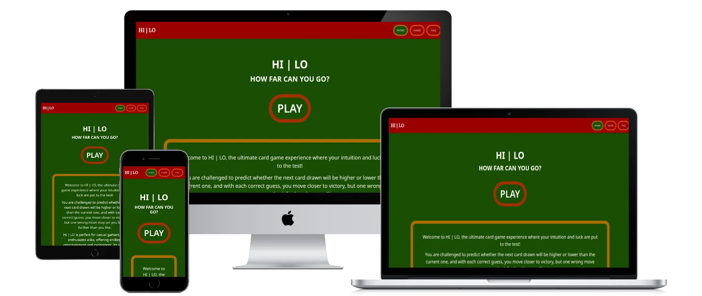

### Site Link

[live site]: https://dvfrancis.github.io/hi-lo-card-game
The [live site] is hosted by Github Pages.

## Index

1. [Overview](#overview)
    1. [Site Preview](#site-preview)
    2. [Site Link](#site-link)
2. [User Experience Design](#user-experience-design)
    1. [Strategy](#strategy)
        1. [Key Business Goals](#key-business-goals)
        2. [Key User Goals](#key-user-goals)
        3. [User Experience](#user-experience)
        4. [User Expectations](#user-expectations)
        5. [User Stories](#user-stories)
        6. [User Personas](#user-personas)
    2. [Scope](#scope)
        1. [Existing Features](#existing-features)
        2. [Future Features](#future-features)
    3. [Structure](#structure)
        1. [User Flow Diagram](#user-flow-diagram)
        2. [Logic Flowchart](#logic-flowchart)
    4. [Skeleton](#skeleton)
        1. [Wireframes](#wireframes)
            1. [Mobile](#mobile)
            2. [Tablet](#tablet)
            3. [Desktop](#desktop)
    5. [Surface](#surface)
        1. [Colours](#colours)
        2. [Typography](#typography)
        3. [Media](#media)
        4. [Content](#content)
3. [Testing](#testing)
4. [Technologies Used](#technologies-used)
5. [Deployment](#deployment)
    1. [GitHub Pages](#github-pages)
    2. [Forks](#forks)
    3. [Local Clones](#local-clones)
    4. [Gitpod Workspaces](#gitpod-workspaces)
6. [Credits and References](#credits-and-references)

7. [Acknowledgements](#acknowledgements)

## User Experience Design

### Strategy

#### Key Business Goals

- To attract players to the game and provide a fun experience.
- The value provided to the website owner is from increasing visitor numbers to the website.
- The call to action on the website's home page will be “Play”.

#### Key User Goals

- Users of all ages visit the website as a way to relax and enjoy playing an easy to understand, and exciting, game.

#### User Experience

- Target audience:
    - Any age.
    - Could be a student, employed, or retired.
    - A casual or firm interest in puzzles.
    - Possibly casual or serious gamer.
    - Those looking for ways to relax and have fun.
 
#### User Expectations

- The website:
    - functions as expected; for example, buttons are easy to identify, and behave like buttons.
    - is accessible and responsive.
    - is easy to navigate.
    - has an appropriate and appealing visual design that reinforces the purpose of the site.

#### User Stories

##### First time visitor goals
    
- “What is this website about?”
- “How do you play the game?”
- “What are the rules of the game?”
- "What can I win?"
        
##### Returning visitor goals
    
- “Will I be able to beat my score from the last time I played?”
    
##### Frequent visitor goals
    
- “I would like to play the game on my mobile device, while travelling”

#### User Personas

The website is designed to appeal to all demographics, but the following personas are meant to represent a range of potential users:

- User 1: Male, student, age 18-21.
- User 2: Female, works part-time, mother of young children, age 25-30.
- User 3: Male, works full-time, professional qualification, age 35-55.
- User 4: Female, retired, grandmother, age 60-80.

##### User 1

“As a student, I want something I can play during my journey to university, so that I’m not bored”

###### Acceptance Criteria

- The website is responsive and displays correctly on a mobile device.
- All messages are clearly displayed and easy to read on smaller screens.
    
###### Tasks

- Style a responsive website using Bootstrap and / or media queries.
- Display any system messages in a larger format.
    
##### User 2

“As a mother of two, I want an easy, quick game to play while looking after my children.”

###### Acceptance Criteria

- The website is quick to load.
- The game can be abandoned, if necessary.
    
###### Tasks

- Ensure the website has excellent load performance on Google Lighthouse.
- Add ability to navigate away from the game at any point. 

##### User 3

“As a project manager, I want a game that I can play to take my mind off my stressful job”

###### Acceptance Criteria

- Gameplay is streamlined and easy to understand.
- The game offers an easy distraction to daily life.
    
###### Tasks

- Add an FAQ page that explains the game and its rules.

##### User 4

“As a retired schoolteacher, I want a fun game that I can enjoy but also possibly use to teach my grand-children about numbers”

###### Acceptance Criteria

- The game has a visually interesting design.
- Cards and scores are displayed clearly and are easy to understand.
    
###### Tasks

- Implement a design that is bright and colourful.
- Display scores clearly on all screen sizes.
- Ensure cards are easy to see and understand.

### Scope

#### Existing Features

- General:

    - All pages responsive, with a layout that automaically adjusts to the user device screen size.
    - The desktop site was used to produce all screenshots in this section, to give the clearest illustration of different aspects of the site. 

- Browser Tab:

    

    
Click to view the browser tab, showing the custom favicon

        
    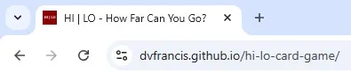
    

    - A favicon has been added to the site to help users identify the site visually and when saved as a browser bookmark / favourite.

- Header:

    

    
Click to view the desktop header

    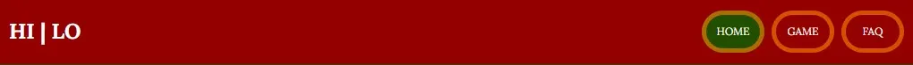
    

    

    
Click to view the mobile header

    
    

    - The website header is fixed at the top fo the screen, and displays the name of the site; it also contains navigation links.
    - It shows the user where they are on the site at any given time, by indicating the currently active page with a green background.
    - Header text is shown on a contrasting plain background.
    - The site's name is left-aligned.
    - Navigation is right-aligned, and contains links to:
        - Home: returns the user to the home page (index.html).
        - Game: takes the user directly to the game page (game.html).
        - FAQ: allows the user to access the frequently asked questions page (faq.html).
    - If the user attempts to access a non-existent page, they will be taken to a custom error page (404-html) which returns them to index.html after 15 seconds; however, this is NOT indicated in the navigation links that appear on 404.html.

- Footer:

    

    
Click to view

    
    
  

    - The footer is sticky, and is alway spushed down to the bottom of the page by website content.
    - It contains social media icons, and legal information, for easy user access.

- Home (index.html):

    - This is the first page a user sees when they enter the site. It contains all pertinent information regarding the podcast, with links to other pages where required.
    - The home page allows the user to get a good overview of the purpose of the website and gives them glimpses of associated activities.

        

- Game (game.html):

- TBC

- FAQ (faq.html):

    - TBC

        

- Custom 404 (404.html):
    - A custom 404 error page appears whenever a user attempts to navigate to a non-existent page.
    - After 30 seconds, the page will redirect automatically to the home page.

        

#### Future Features

- Add the ability to play the classic version of higher-or-lower.
- Add the ability to play the switch version of higher-or-lower.
- Expand site to include different card games.
- Add ability for users to create an account.
- Allow users to be place real wagers in a currency of their choice.

### Structure

#### User Flow Diagram *TO BE UPDATED TO FINAL VERSION*

This diagram shows how the user may interact with the website during a game; dashed lines indicate optional routes.

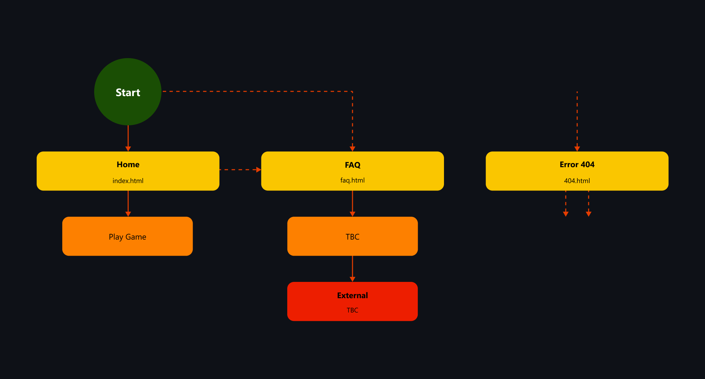

#### Logic Flowchart

The following flowchart explains the logic used for the gameplay:

### Skeleton

#### Wireframes

The wireframes presented here show my initial ideas:

##### Mobile

###### Home
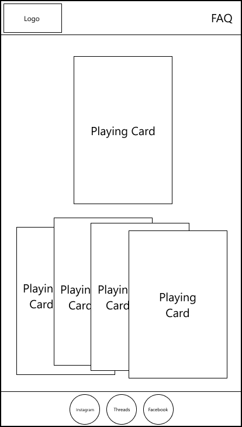

###### FAQ
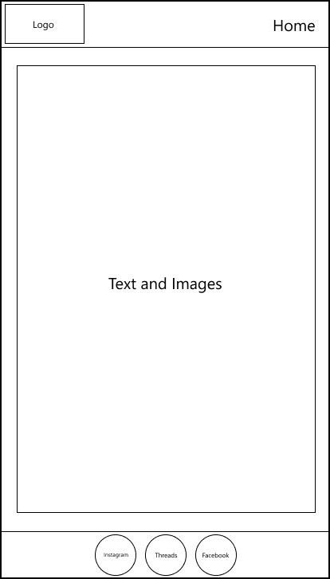

###### 404
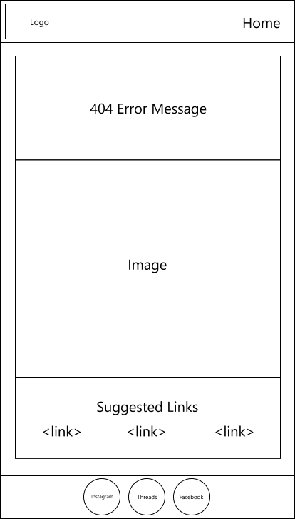

##### Tablet

###### Home
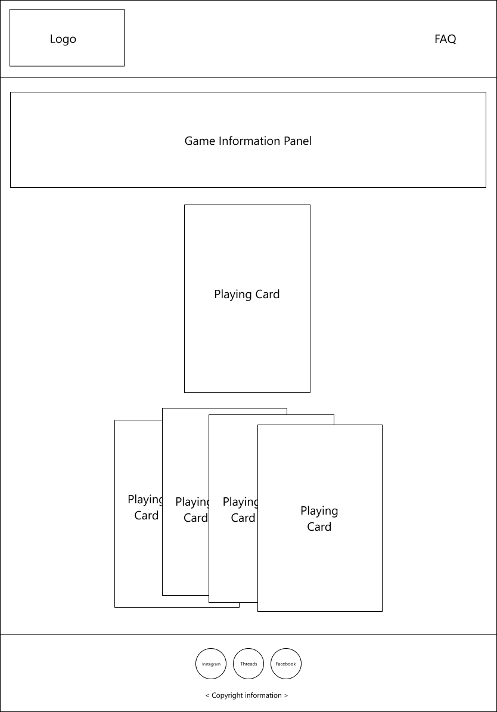

###### FAQ
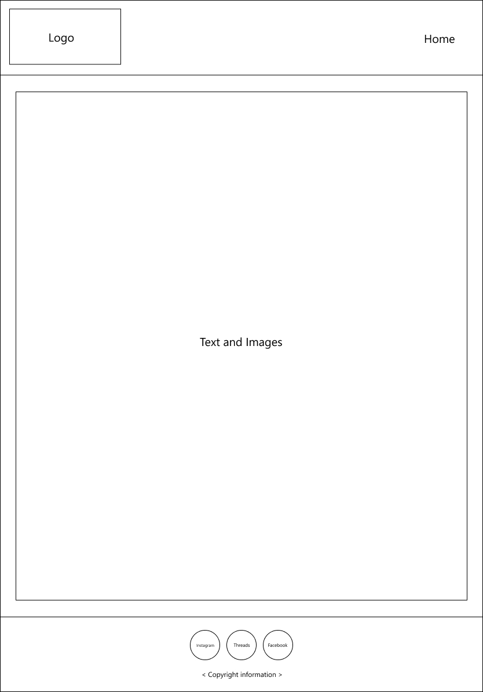

###### 404
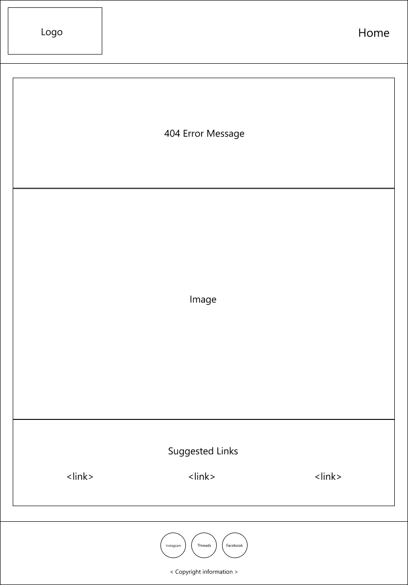

##### Desktop

###### Home
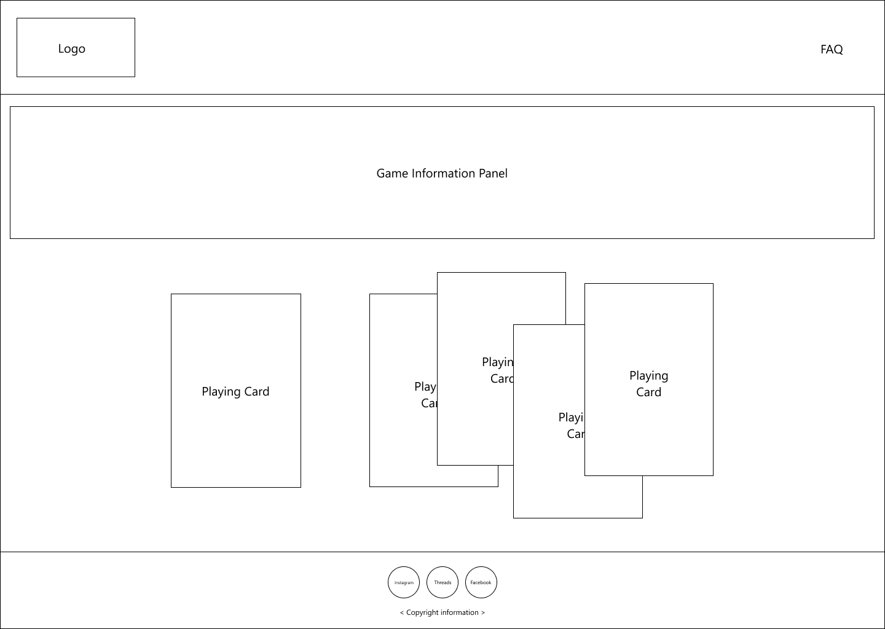

###### FAQ
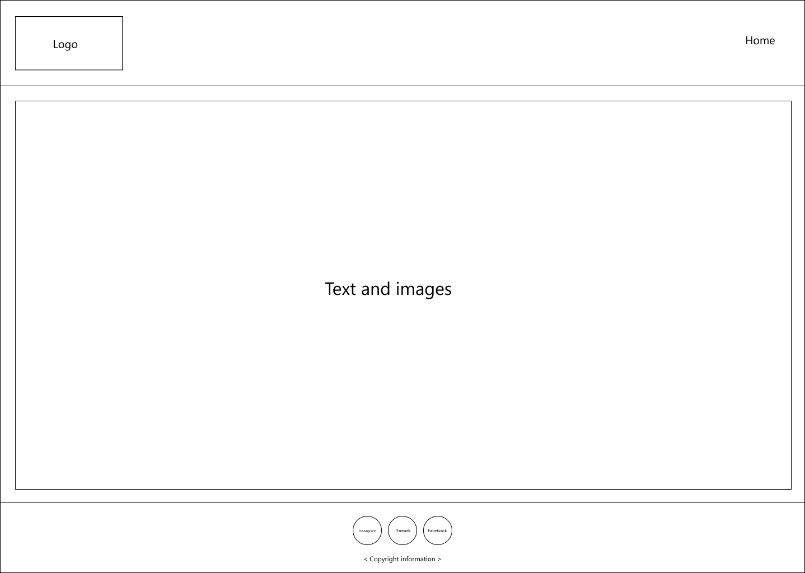

###### 404
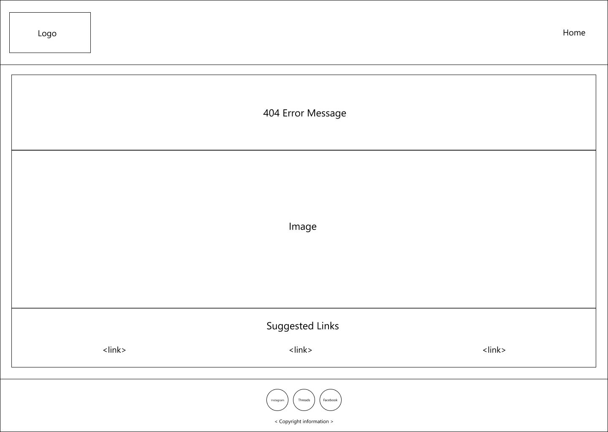

### Surface

#### Colours

The following colours, taken from palette 406 of the Sarah Renae Clarke Colour Catalogue, Volume 2, have been used to add interesting backgrounds to the website, with white (#FFF) as a contrast:

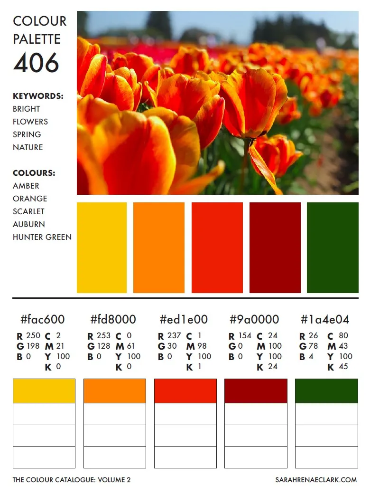

Link state colours for social media icons:

##### Hover

- [Facebook Light Blue (#17A9FD)](https://brandpalettes.com/facebook-colors)
- [Instagram Rose (#E1306C)](https://brandpalettes.com/instagram-color-codes)

##### Active

- [Facebook Dark Blue (#0165E1)](https://brandpalettes.com/facebook-colors)
- [Instagram Purple Red (#C13584)](https://brandpalettes.com/instagram-color-codes)

#### Typography

The fonts used on the site were chosen from Google Fonts:
  
- [Montserrat](https://fonts.google.com/specimen/Montserrat)
- [Lora](https://fonts.google.com/specimen/Lora)
- [Hind Madurai](https://fonts.google.com/specimen/Hind+Madurai)

#### Media

The following images, used on the site, have been taken from [Deposit Photos](https://depositphotos.com/):
- TBC
- TBC

#### Content

All website copy has been written by myself.

## Testing

- Please refer to [TESTING.md](TESTING.md) for details.

## Technologies Used

- The website was built using [HTML](https://en.wikipedia.org/wiki/HTML), [CSS](https://en.wikipedia.org/wiki/CSS), and [JavaScript.](https://en.wikipedia.org/wiki/JavaScript)
- [Bootstrap](https://en.wikipedia.org/wiki/Bootstrap_(front-end_framework)) was used for layout and some styling.
- [Google Chrome Developer Tools](https://developer.chrome.com/docs/devtools/) was used for website troubleshooting, and testing (including [Lighthouse](https://developer.chrome.com/docs/lighthouse/overview/) reports).
- [Google Chrome](https://www.google.co.uk/chrome/) was used for website testing.
- [CSS Tools: Reset CSS](https://meyerweb.com/eric/tools/css/reset/) to reduce browser inconsistencies.
- [Deck of Cards - An API](https://www.deckofcardsapi.com/) - the deck of crds API website.
- The [Responsive Viewer](https://responsiveviewer.org/) extension was used in all browsers (except Firefox, which does not seem to support it) to create images of the website's pages on a variety of devices.
- The [GoFullPage](https://gofullpage.com/) extension was used in all browsers (except Firefox, which does not seem to support it) to capture full-sized images of the website's pages.
- [Microsoft Edge](https://www.microsoft.com/en-gb/edge/) was used for website testing.
- [Microsoft CoPilot](https://copilot.microsoft.com/) - used for general coding advice.
- [Firefox](https://www.mozilla.org/en-GB/firefox/new/) was used for website testing.
- [Opera](https://www.opera.com/) was used for website testing.
- [Safari](https://www.apple.com/uk/safari/) was used for website testing, and mobile screenshots ofan iPhone 12 Pro Max and iPad Pro (12.9-inch) (2nd generation).
- [Figma](https://www.figma.com/) was used to create the user flow diagram, logic flowcharts, and wireframes.
- [Deposit Photos](https://depositphotos.com/) was used for these images on the site:
    - Baize background image TBC.
- [Sarah Renae Clarke's Colour Catalogue V2](https://sarahrenaeclark.com/color-palettes/) was used for the website's colour scheme.
- [Font Joy](https://fontjoy.com/) was used for font pairings.
- [Google Fonts](https://fonts.google.com/) was used to source all fonts.
- [Brand Palettes](https://brandpalettes.com) was used to source the correct Instagram and Facebook link state colours.
- [Microsoft Photos](https://apps.microsoft.com/detail/9wzdncrfjbh4?hl=en-gb&gl=US) was used to edit all images.
- [RespImageLint](https://ausi.github.io/respimagelint/) was used to ensure all website images were fully responsive.
- [To WebP](https://towebp.io/) was used to compress images into webp format.
- [FontAwesome](https://fontawesome.com/) was used for social media icons.
- [GitHub](https://github.com/) was used for version control.
- [GitHub Pages](https://pages.github.com/) was used to host the website.
- [Gitpod](https://gitpod.io/) was used as an online IDE.
- [Markdown](https://en.wikipedia.org/wiki/Markdown) was used to create the README.md and TESTING.md documentation.

## Deployment

### GitHub Pages

The site was deployed using GitHub Pages, as follows:

- Navigate to the GitHub repository.
- Click 'Settings'.
- Under 'Code and automation', select 'Pages'.
- On the 'GitHub Pages' section, under 'Build and deployment > Source' select 'Deploy from a branch'.
- Ensure that the 'main' branch has been selected, and then click 'Save'.

### Forks

To copy the repository to your own GitHub account, so you can make changes without affecting the original version, you can fork it:

- Navigate to the GitHub repository.
- Just above the 'About' section, on the right of the page, click the 'Fork' button.

### Local Clones

To deploy the project on your own computer you can clone it:

- Navigate to the GitHub repository.
- Click the green '<> Code' button above the list of project files.
- From the 'Local' tab, select either HTTPS, SSH, or GitHub CLI as the method of cloning, and copy the associated link.
- Open the terminal or Bash prompt.
- Navigate to the directory where you want to store the cloned copy.
- At the prompt, type `git clone` and add the string copied earlier.
- Press 'Enter' to create the copy.

### Automatically Create a Gitpod Workspace

Click the button below to create a Gitpod workspace from this repository (requires the [Gitpod browser extension](https://www.gitpod.io/docs/configure/user-settings/browser-extension)).

## Credits and References

The following references were used for general advice and help in implementing specific functionality on the website:
- [Duckett, J. (2011) HTML & CSS Design and Build Websites](https://htmlandcssbook.com/) - Indianapolis: John Wiley & Sons, Inc.
- [Duckett, J. (2014) JavaScript and jQuery Interactive Front-End Web Development](https://javascriptbook.com/) - Indianapolis: John Wiley & Sons, Inc.
- [Microsoft Edge Copilot](https://www.microsoft.com/en-us/edge/features/copilot) - coding advice, particularly around CSS rules of ingeritance.
- [How to create a copyright symbol](https://blog.hubspot.com/website/html-code-copyright) - creating the copyright symbol in the footer.
- [Displaying the current year](https://sysadminsage.com/javascript-get-current-year/) - used to display the current copyright year in the footer.
- [Generate a random boolean value](https://stackoverflow.com/questions/36756331/js-generate-random-boolean) - for assigning aces high or low.
- [How to set a favicon in GitHub Pages](https://stackoverflow.com/questions/35037482/favicon-with-github-pages) - setting a favicon on GitGub Pages.
- [W3 Schools CSS :visited Selector](https://www.w3schools.com/cssref/sel_visited.php) and 
 [CSS-Tricks :visited](https://css-tricks.com/almanac/selectors/v/visited/) - styling the navigation links after they had been visited.
- [Background on semantic HTML5 elements](https://www.freecodecamp.org/news/semantic-html5-elements/) - ordering semantic HTMl elements.
- [Redirect to custom form completion page](https://developer.mozilla.org/en-US/docs/Web/HTTP/Redirections?ref=library.linkbot.com) - creating a redirect from the website's custom completion pages.
- [How to Implement ARIA Tags for Better Accessibility](https://dev.to/sarveshh/how-to-implement-aria-tags-for-better-accessibility-a-comprehensive-guide-for-web-developers-h3k) - how and where to use ARIA tags.
- [Using Media queries](https://developer.mozilla.org/en-US/docs/Web/CSS/CSS_media_queries/Using_media_queries) - creating media queries to control ``body`` padding at different screen sizes.
- [Creating a custom 404 page for your GitHub Pages site](https://docs.github.com/en/pages/getting-started-with-github-pages/creating-a-custom-404-page-for-your-github-pages-site) - implementing a GutHub Pages custom 404 page.
- [How To Change the Color of the Bootstrap 5 Mobile Menu Icon](https://www.youtube.com/watch?v=45QSuJaHEss) - altering the colour of the hamburger menu on mobile devices.
- [How to use srcset and sizes for responsive images](https://stackoverflow.com/questions/35099471/how-to-use-srcset-and-sizes-for-responsive-images) - making the website's image carousels more responsive.
- [The Only Markdown Cheatsheet You Need](https://github.com/im-luka/markdown-cheatsheet) - creating the README.md and TESTING.md documentation.
- [Modal](https://getbootstrap.com/docs/5.0/components/modal/) - Bootstrap modal component document.
- [Bootstrap 5 Modal](https://www.w3schools.com/bootstrap5/bootstrap_modal.php) - used to create pop-up modal dialogs.
- [Element: insertAdjacentHTML() method](https://developer.mozilla.org/en-US/docs/Web/API/Element/insertAdjacentHTML) - used for adding modal dialogs to pages.
- [HTML DOM Element remove()](https://www.w3schools.com/jsref/met_element_remove.asp) - used for removing modal dialogs from pages.
- [try...catch](https://developer.mozilla.org/en-US/docs/Web/JavaScript/Reference/Statements/try...catch) - used to test calls to the API.
- [Julia Konovalova's example of Try / Catch.](https://github.com/IuliiaKonovalova/flash_cards/blob/main/assets/js/grammar_quiz.js)
- [localStorage in JavaScript: A complete guide.](https://blog.logrocket.com/localstorage-javascript-complete-guide/)
- [Extracting numbers from localStorage as numbers](https://stackoverflow.com/questions/40005108/extracting-numbers-from-localstorage-as-numbers) - how to convert localStorage values into numbers.

## Acknowledgements

TBC
