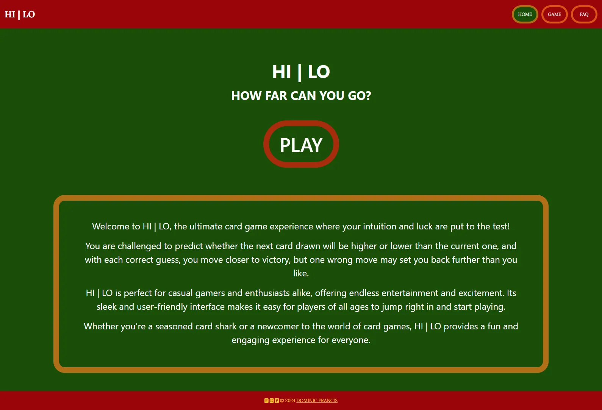
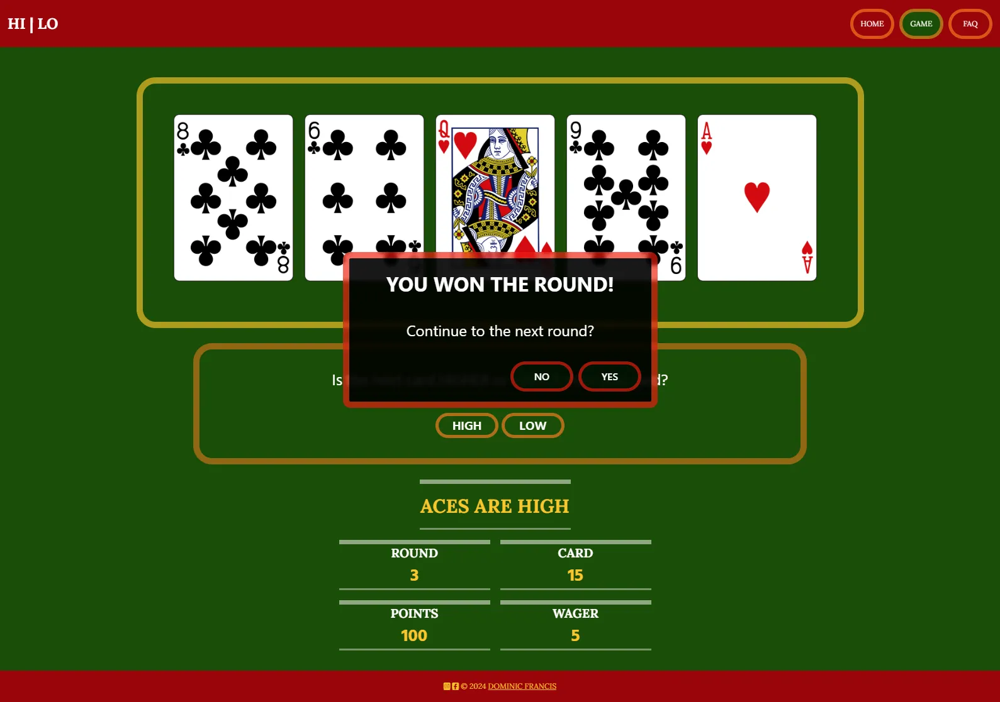
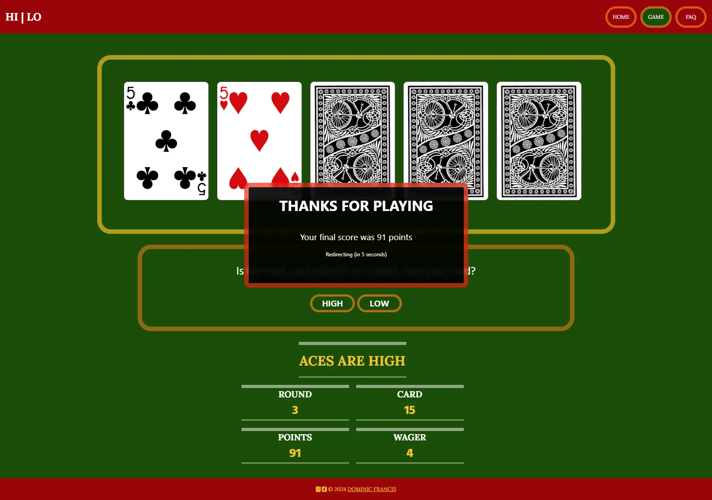
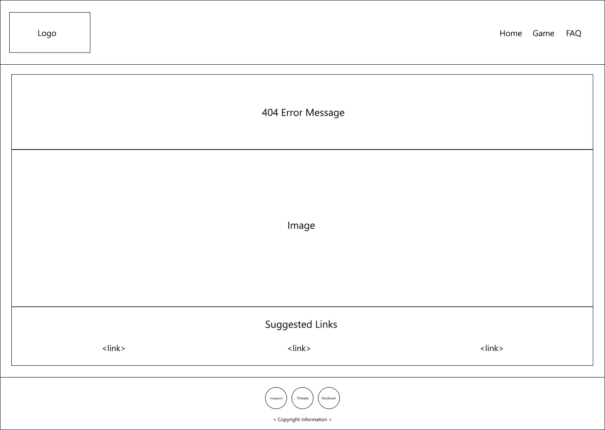

# Higher-or-Lower Premium Card Game

## Overview

Higher-or-lower is a deceptively simple card game where the player has to decide if the next face-down card (in a sequence of cards) is higher or lower than the current face-up card.

The player places a wager on whether or not they can guess the next card correctly until they either guess all cards correctly, or they lose their wager and have to start again; the game ends when all cards, in the pack, have been played, or the player has used up all of their points.

For this website, the gameplay reflects a slightly amended version of higher-or-lower, where the player is dealt five cards at a time (instead of just two). This helps to speed up the gameplay, while introducing a more exciting feel; for example, a player risks losing their wager if they manage to guess four cards correctly but not the fifth.

In the UK, higher-or-lower was the basis for the popular 1980s television game show [Play Your Cards Right](https://en.wikipedia.org/wiki/Play_Your_Cards_Right#:~:text=Learn%20about%20the%20British%20television%20game), where contestants answered questions to guess a longer sequence of cards than that typically used in the classic higher-or-lower card game.

### Site Preview

### Site Link

[live site]: https://dvfrancis.github.io/hi-lo-card-game
The [live site] is hosted by Github Pages.

## Index

1. [Overview](#overview)
    1. [Site Preview](#site-preview)
    2. [Site Link](#site-link)
2. [User Experience Design](#user-experience-design)
    1. [Strategy](#strategy)
        1. [Key Business Goals](#key-business-goals)
        2. [Key User Goals](#key-user-goals)
        3. [User Experience](#user-experience)
        4. [User Expectations](#user-expectations)
        5. [User Stories](#user-stories)
        6. [User Personas](#user-personas)
    2. [Scope](#scope)
        1. [Existing Features](#existing-features)
        2. [Future Features](#future-features)
    3. [Structure](#structure)
        1. [User Flow Diagram](#user-flow-diagram)
        2. [Logic Flowchart](#logic-flowchart)
    4. [Skeleton](#skeleton)
        1. [Wireframes](#wireframes)
            1. [Mobile](#mobile)
            2. [Tablet](#tablet)
            3. [Desktop](#desktop)
    5. [Surface](#surface)
        1. [Colours](#colours)
        2. [Typography](#typography)
        3. [Media](#media)
        4. [Content](#content)
3. [Testing](#testing)
4. [Technologies Used](#technologies-used)
5. [Deployment](#deployment)
    1. [GitHub Pages](#github-pages)
    2. [Forks](#forks)
    3. [Local Clones](#local-clones)
    4. [Automatically Create a Gitpod Workspaces](#automatically-create-a-gitpod-workspace)
6. [Credits and References](#credits-and-references)

7. [Acknowledgements](#acknowledgements)

## User Experience Design

### Strategy

#### Key Business Goals

- To attract players to the game and provide a fun experience.
- The value provided to the website owner is from increasing visitor numbers to the website.
- The call to action on the website's home page will be “Play”.

#### Key User Goals

- Users of all ages visit the website as a way to relax and enjoy playing an easy to understand, and exciting, game.

#### User Experience

- Target audience:
    - Any age.
    - Could be a student, employed, or retired.
    - A casual or firm interest in puzzles.
    - Possibly casual or serious gamer.
    - Those looking for ways to relax and have fun.
 
#### User Expectations

- The website:
    - functions as expected; for example, buttons are easy to identify, and behave like buttons.
    - is accessible and responsive.
    - is easy to navigate.
    - has an appropriate and appealing visual design that reinforces the purpose of the site.

#### User Stories

##### First time visitor goals
    
- “What is this website about?”
- “How do you play the game?”
- “What are the rules of the game?”
- "What can I win?"
        
##### Returning visitor goals
    
- “Will I be able to beat my score from the last time I played?”
    
##### Frequent visitor goals
    
- “I would like to play the game on my mobile device, while travelling”

#### User Personas

The website is designed to appeal to all demographics, but the following personas are meant to represent a range of potential users:

- User 1: Male, student, age 18-21.
- User 2: Female, works part-time, mother of young children, age 25-30.
- User 3: Male, works full-time, professional qualification, age 35-55.
- User 4: Female, retired, grandmother, age 60-80.

##### User 1

“As a student, I want something I can play during my journey to university, so that I’m not bored”

###### Acceptance Criteria

- The website is responsive and displays correctly on a mobile device.
- All messages are clearly displayed and easy to read on smaller screens.
    
###### Tasks

- Style a responsive website using Bootstrap and / or media queries.
- Display any system messages in a larger format.
    
##### User 2

“As a mother of two, I want an easy, quick game to play while looking after my children.”

###### Acceptance Criteria

- The website is quick to load.
- The game can be abandoned, if necessary.
    
###### Tasks

- Ensure the website has excellent load performance on Google Lighthouse.
- Add ability to navigate away from the game at any point. 

##### User 3

“As a project manager, I want a game that I can play to take my mind off my stressful job”

###### Acceptance Criteria

- Gameplay is streamlined and easy to understand.
- The game offers an easy distraction to daily life.
    
###### Tasks

- Add an FAQ page that explains the game and its rules.

##### User 4

“As a retired schoolteacher, I want a fun game that I can enjoy but also possibly use to teach my grand-children about numbers”

###### Acceptance Criteria

- The game has a visually interesting design.
- Cards and scores are displayed clearly and are easy to understand.
    
###### Tasks

- Implement a design that is bright and colourful.
- Display scores clearly on all screen sizes.
- Ensure cards are easy to see and understand.

### Scope

#### Existing Features

- General:

    - All pages responsive, with a layout that automaically adjusts to the user device screen size.
    - The desktop site was used to produce all screenshots in this section, to give the clearest illustration of different aspects of the site. 

- Browser Tab:

    

    
Click to view the browser tab, showing the custom favicon

        
    
    

    - A favicon has been added to the site to help users identify the site visually and when saved as a browser bookmark / favourite.

- Header:

    

    
Click to view the desktop header

    
    

    

    
Click to view the mobile header

    
    

    - The website header is fixed at the top fo the screen, and displays the name of the site; it also contains navigation links.
    - It shows the user where they are on the site at any given time, by indicating the currently active page with a green background.
    - Header text is shown on a contrasting plain background.
    - The site's name is left-aligned.
    - Navigation is right-aligned, and contains links to:
        - Home: returns the user to the home page (index.html).
        - Game: takes the user directly to the game page (game.html).
        - FAQ: allows the user to access the frequently asked questions page (faq.html).
    - If the user attempts to access a non-existent page, they will be taken to a custom error page (404-html) which returns them to index.html after 15 seconds; however, this is NOT indicated in the navigation links that appear on 404.html.

- Footer:

    

    
Click to view

    
    
  

    - The footer is sticky, and is alway spushed down to the bottom of the page by website content.
    - It contains social media icons, and legal information, for easy user access.

- Home (index.html):

    

    
Click to view the home page

    
    
  

    - The home page introduces the site, but its main purpose is to provide the main call to action - which is to play the game.
    - The browser tab displays the custom favicon and a title - "HI | LO - How Far Can You Go?".

- Game (game.html):

    

    
Click to view the game page

    
    

    

    
Click to view the game page (when navigating away via the links in the header)

    
    

    

    
Click to view the game page (when winning a round)

    
    

    

    
Click to view the game page (when lost a round)

    
    

    

    
Click to view the game page (when drawn a round)

    
    

    

    
Click to view the game page (when reaching the penultimate round)

    
    

    

    
Click to view the game page (when leaving the game after any round, before the end of the game)

    
    

    

    
Click to view the game page (when game completed)

    
    

    - The game page is where a player plays the game (see screenshot above):
        - The cards for the current round are prominiently displayed at the top of the page (surrounded by a yellow border).
        - All messages relating to gameplay are displayed in the central section (surrounded by an orange border).
        - It clearly shows all information pertinent to the game, such as player points and wager, at the bottom of the page.
        - It informs a player of their game progress, via the round number and card number, at the bottom of the page.
    - If a player attempts to navigate away from the page, via the links in the header, a warning will appear (see screenshot above):
        - If a player still wishes to abandon the game, they are shown their last score and redirected to the link they clicked (see screenshot above).
    - If a player wins a round, they are asked whether or not they wish to continue (see screenshot above).
    - If a player loses or draws a round, they are asked whether or not they wish to continue (see screenshot above).
    - If a player reaches the penultimate round of a game, they are asked whether or not they wish to continue (see screenshot above).
    - If a player does not wish to continue after winning, losing, or drawing a round, or once they reach the last round, they are shown their final score and redirected to the home page (see screenshot above).
    - If a player completes an entire game of ten rounds, they are shown their final score and their highest score (see screenshot above).
    - The browser tab displays the custom favicon and a title - "HI | LO - Play The Game".

- FAQ (faq.html):

    

    
Click to view the FAQ page

    
    
  

    - The FAQ provides background information about the game, and how it's played.
    - The browser tab displays the custom favicon and a title - "HI | LO - FAQ".

- Custom 404 (404.html):

    

    
Click to view the custom error page

    
    
  

    - If a player navigates to an invalid page, the custom error page is displayed.
    - It provides a humourous, yet informative, pause for the user.
    - It also links to the FAQ page.
    - After 15 seconds, it redirects to the home page.
    - The browser tab displays the custom favicon and a title - "HI | LO - It's a Busted Flush!".

#### Future Features

- Add the ability to play the classic version of higher-or-lower.
- Add the ability to play the switch version of higher-or-lower.
- Add the ability to play the premium version of higher-or-lower.
- Add ability for a player to create an account.
- Add ability to track and display multiple players' high scores.
- Expand site to include different card games.
- Allow players to place real wagers in a currency of their choice.

### Structure

#### User Flow Diagram

Click to view the user flow diagram

User flow diagram of potential user-website interaction routes - optional pathways indicated by dashed lines.

#### Logic Flowchart

Click to view the gameplay logic flowchart

Flowchart explaining the logic behind the HI | LO game; used to formulate JavaScript code.

### Skeleton

#### Wireframes

Wireframe diagrams of my initial ideas:

##### Mobile

###### Home

Click to view the mobile home page wireframe

###### Game

Click to view the mobile game page wireframe

###### FAQ

Click to view the mobile FAQ page wireframe

###### 404

Click to view the mobile custom error page wireframe

##### Tablet

###### Home

Click to view the tablet home page wireframe

###### Game

Click to view the tablet game page wireframe

###### FAQ

Click to view the tablet FAQ page wireframe

###### 404

Click to view the tablet custom error page wireframe

##### Desktop

###### Home

Click to view the desktop home page wireframe

###### Game

Click to view the desktop game page wireframe

###### FAQ

Click to view the desktop FAQ page wireframe

###### 404

Click to view the desktop custom error page wireframe

### Surface

#### Colours

Click to view the chosen colour scheme

- Website colours were chosen by using the Sarah Renae Clarke Colour Catalogue (Volume 2) card 406.
- Text colours on the website are a mix of white (#FFF) and black (#000).

#### Typography

The fonts used on the site were chosen from Google Fonts:
  
- [Montserrat](https://fonts.google.com/specimen/Montserrat)
- [Lora](https://fonts.google.com/specimen/Lora)
- [Hind Madurai](https://fonts.google.com/specimen/Hind+Madurai)

#### Media

The following image was taken from [Deposit Photos](https://depositphotos.com/), and used on the 404.html page:
- [Devastated gambler man...](https://depositphotos.com/photo/devastated-gambler-man-losing-lot-money-playing-poker-casino-gambling-439339268.html)

#### Content

All website copy has been written by myself.

## Testing

- Please refer to [TESTING.md](TESTING.md) for details.

## Technologies Used

- [HTML](https://en.wikipedia.org/wiki/HTML), [CSS](https://en.wikipedia.org/wiki/CSS), and [JavaScript.](https://en.wikipedia.org/wiki/JavaScript) - for website structure / interactivity.
- [Bootstrap](https://en.wikipedia.org/wiki/Bootstrap_(front-end_framework)) - for layout / some styling.
- [Google Chrome Developer Tools](https://developer.chrome.com/docs/devtools/) - for troubleshooting / testing (including for [Lighthouse](https://developer.chrome.com/docs/lighthouse/overview/) performance reports).
- [Deck of Cards - An API](https://www.deckofcardsapi.com/) - for deck of cards API.
- [GitHub](https://github.com/) - for version control.
- [GitHub Pages](https://pages.github.com/) - for website hosting.
- [Gitpod](https://gitpod.io/) - for online coding.
- [Figma](https://www.figma.com/) - for flow diagrams / flowcharts / wireframes.
- [Visual Studio Code](https://code.visualstudio.com/) - for local coding.
- [Microsoft CoPilot](https://copilot.microsoft.com/) - for general coding advice.
- [Google Fonts](https://fonts.google.com/) - for all fonts.
- [FontAwesome](https://fontawesome.com/) - for all icons.
- [Markdown](https://en.wikipedia.org/wiki/Markdown) - for formatting all documentation.
- [Google Chrome](https://www.google.co.uk/chrome/) - for website preview / testing.
- [Microsoft Edge](https://www.microsoft.com/en-gb/edge/) - for website preview / testing.
- [Firefox](https://www.mozilla.org/en-GB/firefox/new/) - for website preview / testing.
- [Opera](https://www.opera.com/) - for website preview / testing.
- [Safari](https://www.apple.com/uk/safari/) - for website preview / testing and mobile screenshots (using an iPhone 12 Pro Max and iPad Pro (12.9-inch) (2nd generation)).
- [W3C HTML Checker](https://validator.w3.org/) - for checking HTML code.
- [W3C CSS Checker](https://jigsaw.w3.org/css-validator/) - for checking CSS code.
- [Web Accessibility Evaluation Tool (WAVE)](https://wave.webaim.org/) - for checking website accessibility.
- [Responsive Web Design Checker](https://responsivedesignchecker.com/) - for checking website responsiveness.
- [Web Accessibility in Mind (WebAIM) Contrast Checker](https://webaim.org/resources/contrastchecker/) - for checking website contrast.
- [JSHint](https://jshint.com/) - for checking JavaScript code.
- [CSS Tools: Reset CSS](https://meyerweb.com/eric/tools/css/reset/) - for addressing browser inconsistencies.
- [Website Mockup Generator](https://websitemockupgenerator.com/) - for a preview of the site on different devices.
- [GoFullPage](https://gofullpage.com/) - for exporting full-size web page previews (this does not include Firefox, which does not support it).
- [Deposit Photos](https://depositphotos.com/) - for the [Devastated gambler man...](https://depositphotos.com/photo/devastated-gambler-man-losing-lot-money-playing-poker-casino-gambling-439339268.html) image used on the 404.html page.
- [Sarah Renae Clarke's Colour Catalogue V2](https://sarahrenaeclark.com/color-palettes/) - for website colours.
- [Font Joy](https://fontjoy.com/) - for font pairing inspiration.
- [Microsoft Photos](https://apps.microsoft.com/detail/9wzdncrfjbh4?hl=en-gb&gl=US) - for image editing.
- [Affinity Photo 2](https://affinity.serif.com/en-gb/photo/) - for image editing.
- [To WebP](https://towebp.io/) - for generating webp images.
- [Favicon Generator](https://favicon.io/favicon-converter/) - for generating website favicon.
- [Diffchecker](https://www.diffchecker.com/) - for comparing JavaScript code.

## Deployment

### GitHub Pages

The site was deployed using GitHub Pages, as follows:

- Navigate to the GitHub repository.
- Click 'Settings'.
- Under 'Code and automation', select 'Pages'.
- On the 'GitHub Pages' section, under 'Build and deployment > Source' select 'Deploy from a branch'.
- Ensure that the 'main' branch has been selected, and then click 'Save'.

### Forks

To copy the repository to your own GitHub account, so you can make changes without affecting the original version, you can fork it:

- Navigate to the GitHub repository.
- Just above the 'About' section, on the right of the page, click the 'Fork' button.

### Local Clones

To deploy the project on your own computer you can clone it:

- Navigate to the GitHub repository.
- Click the green '<> Code' button above the list of project files.
- From the 'Local' tab, select either HTTPS, SSH, or GitHub CLI as the method of cloning, and copy the associated link.
- Open the terminal or Bash prompt.
- Navigate to the directory where you want to store the cloned copy.
- At the prompt, type `git clone` and add the string copied earlier.
- Press 'Enter' to create the copy.

### Automatically Create a Gitpod Workspace

Click the button below to create a Gitpod workspace from this repository (requires the [Gitpod browser extension](https://www.gitpod.io/docs/configure/user-settings/browser-extension)).

## Credits and References

- [Duckett, J. (2011) HTML & CSS Design and Build Websites](https://htmlandcssbook.com/) - Indianapolis: John Wiley & Sons, Inc.
- [Duckett, J. (2014) JavaScript and jQuery Interactive Front-End Web Development](https://javascriptbook.com/) - Indianapolis: John Wiley & Sons, Inc.
- [How to create a copyright symbol](https://blog.hubspot.com/website/html-code-copyright) - for the footer copyright symbol.
- [Displaying the current year](https://sysadminsage.com/javascript-get-current-year/) - for displaying the current copyright year in the footer.
- [Generate a random boolean value](https://stackoverflow.com/questions/36756331/js-generate-random-boolean) - for assigning aces high or low.
- [How to set a favicon in GitHub Pages](https://stackoverflow.com/questions/35037482/favicon-with-github-pages) - for setting a GitGub Pages favicon.
- [Modal](https://getbootstrap.com/docs/5.0/components/modal/) - for generating a Bootstrap modal.
- [Bootstrap 5 Modal](https://www.w3schools.com/bootstrap5/bootstrap_modal.php) - for Bootstrap pop-up modal dialogs.
- [Element: insertAdjacentHTML() method](https://developer.mozilla.org/en-US/docs/Web/API/Element/insertAdjacentHTML) - for adding modal dialogs to pages.
- [HTML DOM Element remove()](https://www.w3schools.com/jsref/met_element_remove.asp) - for removing modal dialogs from pages.
- [try...catch](https://developer.mozilla.org/en-US/docs/Web/JavaScript/Reference/Statements/try...catch) - for testing calls to the API.
- [Julia Konovalova's example of Try / Catch.](https://github.com/IuliiaKonovalova/flash_cards/blob/main/assets/js/grammar_quiz.js)
- [localStorage in JavaScript: A complete guide.](https://blog.logrocket.com/localstorage-javascript-complete-guide/)
- [Extracting numbers from localStorage as numbers](https://stackoverflow.com/questions/40005108/extracting-numbers-from-localstorage-as-numbers) - how to convert localStorage values into numbers.

## Acknowledgements

- Extra special thanks to Andrew Parton, for his coding advice and support.
- Thanks to my mentor, Juliia Konovalova, for her coding advice.