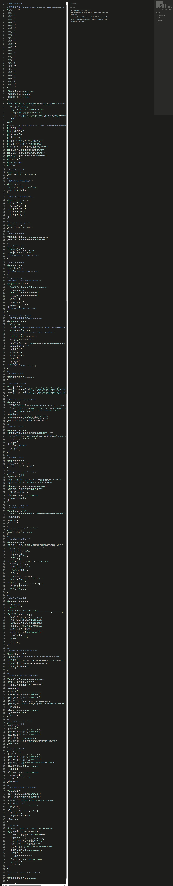

[Return to the Hi-Lo card game README.md](https://github.com/dvfrancis/hi-lo-card-game/blob/main/README.md)

# Testing *THIS DOCUMENT IS NOT YET COMPLETE*

## Index

1. [Code Validation](#code-validation)
    1. [HTML](#html)
        1. [index.html](#indexhtml)
        2. [game.html](#gamehtml)
        3. [faq.html](#faqhtml)
        4. [404.html](#404html)
    2. [CSS](#css)
        1. [index.html](#indexhtml-1)
        2. [game.html](#gamehtml-1)
        3. [faq.html](#faqhtml-1)
        4. [404.html](#404html-1)
    3. [JavaScript](#javascript)
        1. [general.js](#generaljs)
        2. [index.js](#indexjs)
        3. [game.js](#gamejs)
2. [Manual Validation](#manual-validation)
    1. [index.html](#indexhtml-2)
    2. [game.html](#gamehtml-2)
    3. [faq.html](#faqhtml-2)
    4. [404.html](#404html-2)
    5. [general.js](#generaljs-1)
    6. [index.js](#indexjs-1)
    7. [game.js](#gamejs-1)
3. [User Story Validation](#user-story-validation)
    1. [First Time Visitor Goals](#first-time-visitor-goals)
    2. [Returning Visitor Goals](#returning-visitor-goals)
    3. [Frequent Visitor Goals](#frequent-visitor-goals)
4. [User Personas](#user-personas)
    1. [User 1](#user-1)
    2. [User 2](#user-2)
    3. [User 3](#user-3)
    4. [User 4](#user-4)
4. [Browser Compatibility](#browser-compatibility)
    1. [Google Chrome](#google-chrome)
    2. [Microsoft Edge](#microsoft-edge)
    3. [Firefox](#firefox)
    4. [Opera](#opera)
    5. [Safari (on an iPhone)](#safari-on-an-iphone)
    6. [Safari (on an iPad)](#safari-on-an-ipad)
5. [Accessibility](#accessibility)
    1. [index.html](#indexhtml-3)
    2. [game.html](#gamehtml-3)
    3. [faq.html](#faqhtml-3)
    4. [404.html](#404html-3)
6. [Responsiveness](#responsiveness)
    1. [index.html](#indexhtml-4)
    2. [game.html](#gamehtml-4)
    3. [faq.html](#faqhtml-4)
    4. [404.html](#404html-4)
7. [Performance](#performance)
    1. [index.html](#indexhtml-5)
    2. [game.html](#gamehtml-5)
    3. [faq.html](#faqhtml-5)
    4. [404.html](#404html-5)
8. [Bugs](#bugs)
9. [Unfixed Bugs](#unfixed-bugs)

## Code Validation

### HTML

Below are the results of HTML validation for each page, using the [W3C Markup Validation Service](https://validator.w3.org):

#### index.html

Click here to see the HTML validation report for index.html

#### game.html

Click here to see the HTML validation report for game.html

#### faq.html

Click here to see the HTML validation report for faq.html

#### 404.html

Click here to see the HTML validation report for 404.html

### CSS

Below are the results of CSS validation for each page, using the [W3C CSS Validation Service](https://jigsaw.w3.org/css-validator).

#### index.html

Click here to see the CSS validation report for index.html

#### game.html

Click here to see the CSS validation report for game.html

#### faq.html

Click here to see the CSS validation report for faq.html

#### 404.html

Click here to see the CSS validation report for 404.html

### JavaScript

Below are the results of JavaScript validation for each script file, using [JSHint](https://jshint.com/).

#### general.js

Click here to see the JavaScript validation report for general.js

#### index.js

Click here to see the JavaScript validation report for index.js

#### game.js

Click here to see the JavaScript validation report for game.js

## Manual Validation

Here are the results of a manual test of all links, and any form fields, for each page:

### index.html

| ITEM | PROCESS | EXPECTED RESULT | ACTUAL RESULT | STATUS |
| --- | --- | --- | --- | --- |
| Navigation bar link - "Home" | Click to open index.html | The user is directed to index.html | The user is directed to index.html | PASS |
| Navigation bar link - "Game" | Click to open game.html | The user is directed to game.html | The user is directed to game.html | PASS |
| Navigation bar link - "FAQ" | Click to open faq.html | The user is directed to faq.html | The user is directed to faq.html | PASS |
| Button link - "Play"" | Click to open game.html | The user is directed to game.html | The user is directed to game.html | PASS |
| Social media icon - Threads | Click to open Threads in a new tab  | The link opens in a new tab  | The link opens in a new tab | PASS |
| Social media icon - Instagram | Click to open Instagram in a new tab  | The link opens in a new tab  | The link opens in a new tab | PASS |
| Social media icon - Facebook | Click to open Facebook in a new tab  | The link opens in a new tab  | The link opens in a new tab | PASS |
| Footer link - "Dominic Francis" | Click to open dominicfrancis.co.uk in a new tab | The link opens in a new tab  | The link opens in a new tab | PASS |

### game.html

| ITEM | PROCESS | EXPECTED RESULT | ACTUAL RESULT | STATUS |
| --- | --- | --- | --- | --- |
| Navigation bar link - "Home" | Click to open index.html | The user is asked if they want to leave the game. If they click 'Yes', they are directed to index.html, following a five second delay. If they click 'No' the modal dialog disappears, and they remain on game.html  | The user is asked if they want to leave the game. If they click 'Yes', they are directed to index.html, following a five second delay. If they click 'No' the modal dialog disappears, and they remain on game.html | PASS |
| Navigation bar link - "Game" | Click to open game.html | The user is asked if they want to leave the game. If they click 'Yes', game.html is reloaded in the same window (and a new game begins), following a five second delay. If they click 'No' the modal dialog disappears, and they continue their current game on game.html |  The user is asked if they want to leave the game. If they click 'Yes', game.html is reloaded in the same window (and a new game begins), following a five second delay. If they click 'No' the modal dialog disappears, and they continue their current game on game.html | PASS |
| Navigation bar link - "FAQ" | Click to open faq.html | The user is asked if they want to leave the game. If they click 'Yes', they are directed to faq.html, following a five second delay. If they click 'No' the modal dialog disappears, and they remain on game.html | The user is asked if they want to leave the game. If they click 'Yes', they are directed to faq.html, following a five second delay. If they click 'No' the modal dialog disappears, and they remain on game.html | PASS |
| Game - wager entry field (with a valid entry - more than zero and less than total player points) | Enter a valid wager amount, and click 'OK' to submit | The user's wager is accepted, and they are prompted to select if the next card is higher or lower | The user's wager is accepted, and they are prompted to select if the next card is higher or lower | PASS |
| Game - wager entry field (with an invalid entry - more than total player points / a zero amount / a blank entry / a text entry) | Enter an invalid wager amount, and click 'OK' to submit | The user's wager is rejected, the field is cleared, a message is displayed "Your wager must be a number between 1 and your total points. Please try again.", and they are able to re-enter a new amount | The user's wager is rejected, the field is cleared, a message is displayed "Your wager must be a number between 1 and your total points. Please try again.", and they are able to re-enter a new amount | PASS |
| Social media icon - Threads | Click to open Threads in a new tab  | The link opens in a new tab  | The link opens in a new tab | PASS |
| Social media icon - Instagram | Click to open Instagram in a new tab  | The link opens in a new tab  | The link opens in a new tab | PASS |
| Social media icon - Facebook | Click to open Facebook in a new tab  | The link opens in a new tab  | The link opens in a new tab | PASS |
| Footer link - "Dominic Francis" | Click to open dominicfrancis.co.uk in a new tab | The link opens in a new tab  | The link opens in a new tab | PASS |

### faq.html

| ITEM | PROCESS | EXPECTED RESULT | ACTUAL RESULT | STATUS |
| --- | --- | --- | --- | --- |
| Navigation bar link - "Home" | Click to open index.html | The user is directed to index.html | The user is directed to index.html | PASS |
| Navigation bar link - "Game" | Click to open game.html | The user is directed to game.html | The user is directed to game.html | PASS |
| Navigation bar link - "FAQ" | Click to open faq.html | The user is directed to faq.html | The user is directed to faq.html | PASS |
| Accordion header - "What is HI LO?" | Click to expand / collapse the section | The section expands / collapses  | The section expands / collapses | PASS |
| Accordion header - "How do I play?" | Click to expand / collapse the section | The section expands / collapses  | The section expands / collapses | PASS |
| Accordion header - "Is there a minimum or maximum wager for each round?" | Click to expand / collapse the section | The section expands / collapses  | The section expands / collapses | PASS |
| Accordion header - "Are Aces considered high or low?" | Click to expand / collapse the section | The section expands / collapses  | The section expands / collapses | PASS |
| Social media icon - Threads | Click to open Threads in a new tab  | The link opens in a new tab  | The link opens in a new tab | PASS |
| Social media icon - Instagram | Click to open Instagram in a new tab  | The link opens in a new tab  | The link opens in a new tab | PASS |
| Social media icon - Facebook | Click to open Facebook in a new tab  | The link opens in a new tab  | The link opens in a new tab | PASS |
| Footer link - "Dominic Francis" | Click to open dominicfrancis.co.uk in a new tab | The link opens in a new tab  | The link opens in a new tab | PASS |

### 404.html

| ITEM | PROCESS | EXPECTED RESULT | ACTUAL RESULT | STATUS |
| --- | --- | --- | --- | --- |
| Navigation bar link - "Home" | Click to open index.html | The user is directed to index.html | The user is directed to index.html | PASS |
| Navigation bar link - "Game" | Click to open game.html | The user is directed to game.html | The user is directed to game.html | PASS |
| Navigation bar link - "FAQ" | Click to open faq.html | The user is directed to faq.html | The user is directed to faq.html | PASS |
| Navigation link in text - "Alternatively, you might want to play your cards right by visiting the FAQ" | Click to open faq.html | The user is directed to faq.html | The user is directed to faq.html | PASS |
| Auto redirect (after 15 seconds) | The page is automatically redirected to index.html after 15 seconds have elapsed | The index.html page loads after 15 seconds | The index.html page loads after 15 seconds | PASS |
| Social media icon - Threads | Click to open Threads in a new tab  | The link opens in a new tab  | The link opens in a new tab | PASS |
| Social media icon - Instagram | Click to open Instagram in a new tab  | The link opens in a new tab  | The link opens in a new tab | PASS |
| Social media icon - Facebook | Click to open Facebook in a new tab  | The link opens in a new tab  | The link opens in a new tab | PASS |
| Footer link - "Dominic Francis" | Click to open dominicfrancis.co.uk in a new tab | The link opens in a new tab  | The link opens in a new tab | PASS |

### general.js

| ITEM | PROCESS | EXPECTED RESULT | ACTUAL RESULT | STATUS |
| --- | --- | --- | --- | --- |
| Site title - "The Older & Wider Podcast" | Click to return to index.html | The user is directed to index.html | The user is directed to index.html | PASS |
| Navigation bar link - "Home" | Click to open index.html | The user is directed to index.html | The user is directed to index.html | PASS |
| Navigation bar link - "About" | Click to open about.html | The user is directed to about.html | The user is directed to about.html | PASS |
| Navigation bar link - "Message Board" | Click to open message-board.html | The user is directed to message-board.html | The user is directed to message-board.html | PASS |
| Navigation bar link - "Contact"" | Click to open contact.html | The user is directed to contact.html | The user is directed to contact.html | PASS |
| Auto redirect (after 30 seconds) | The page is automatically directed to index.html after 30 seconds have elapsed | The index.html page loads after 30 seconds | The index.html page loads after 30 seconds | PASS |
| Button - "Return to the home page" | Click to move to index.html | The user is directed to the home page | The user is directed to the home page | PASS |
| Button - "Learn about the podcast" | Click to move to about.html | The user is directed to the about page | The user is directed to the about page | PASS |
| Button - "View the 'Message Board'" | Click to move to message-board.html | The user is directed to the message board page | The user is directed to the message board page | PASS |
| Button - "Why not send us a message?" | Click to move to contact.html | The user is directed to the contact page | The user is directed to the contact page | PASS |
| Social media icon - Instagram | Click to open the Older & Wider Instagram page in a new tab  | The link opens in a new tab  | The link opens in a new tab | PASS |
| Social media icon - Facebook | Click to open the Older & Wider Facebook page in a new tab  | The link opens in a new tab  | The link opens in a new tab | PASS |
| Footer link - "Dominic Francis" | Click to open dominicfrancis.co.uk in a new tab | The link opens in a new tab  | The link opens in a new tab | PASS |
| Footer link - "Older & Wider" | Click to open the Acast Older & Wider website in a new tab | The link opens in a new tab  | The link opens in a new tab | PASS |
| Footer link - "Acast" | Click to open the Acast website in a new tab | The link opens in a new tab  | The link opens in a new tab | PASS |

### index.js

| ITEM | PROCESS | EXPECTED RESULT | ACTUAL RESULT | STATUS |
| --- | --- | --- | --- | --- |
| Site title - "The Older & Wider Podcast" | Click to return to index.html | The user is directed to index.html | The user is directed to index.html | PASS |
| Navigation bar link - "Home" | Click to open index.html | The user is directed to index.html | The user is directed to index.html | PASS |
| Navigation bar link - "About" | Click to open about.html | The user is directed to about.html | The user is directed to about.html | PASS |
| Navigation bar link - "Message Board" | Click to open message-board.html | The user is directed to message-board.html | The user is directed to message-board.html | PASS |
| Navigation bar link - "Contact"" | Click to open contact.html | The user is directed to contact.html | The user is directed to contact.html | PASS |
| Auto redirect (after 30 seconds) | The page is automatically directed to index.html after 30 seconds have elapsed | The index.html page loads after 30 seconds | The index.html page loads after 30 seconds | PASS |
| Button - "Return to the home page" | Click to move to index.html | The user is directed to the home page | The user is directed to the home page | PASS |
| Button - "Learn about the podcast" | Click to move to about.html | The user is directed to the about page | The user is directed to the about page | PASS |
| Button - "View the 'Message Board'" | Click to move to message-board.html | The user is directed to the message board page | The user is directed to the message board page | PASS |
| Button - "Why not send us a message?" | Click to move to contact.html | The user is directed to the contact page | The user is directed to the contact page | PASS |
| Social media icon - Instagram | Click to open the Older & Wider Instagram page in a new tab  | The link opens in a new tab  | The link opens in a new tab | PASS |
| Social media icon - Facebook | Click to open the Older & Wider Facebook page in a new tab  | The link opens in a new tab  | The link opens in a new tab | PASS |
| Footer link - "Dominic Francis" | Click to open dominicfrancis.co.uk in a new tab | The link opens in a new tab  | The link opens in a new tab | PASS |
| Footer link - "Older & Wider" | Click to open the Acast Older & Wider website in a new tab | The link opens in a new tab  | The link opens in a new tab | PASS |
| Footer link - "Acast" | Click to open the Acast website in a new tab | The link opens in a new tab  | The link opens in a new tab | PASS |

### game.js

| ITEM | PROCESS | EXPECTED RESULT | ACTUAL RESULT | STATUS |
| --- | --- | --- | --- | --- |
| Site title - "The Older & Wider Podcast" | Click to return to index.html | The user is directed to index.html | The user is directed to index.html | PASS |
| Navigation bar link - "Home" | Click to open index.html | The user is directed to index.html | The user is directed to index.html | PASS |
| Navigation bar link - "About" | Click to open about.html | The user is directed to about.html | The user is directed to about.html | PASS |
| Navigation bar link - "Message Board" | Click to open message-board.html | The user is directed to message-board.html | The user is directed to message-board.html | PASS |
| Navigation bar link - "Contact"" | Click to open contact.html | The user is directed to contact.html | The user is directed to contact.html | PASS |
| Auto redirect (after 30 seconds) | The page is automatically directed to index.html after 30 seconds have elapsed | The index.html page loads after 30 seconds | The index.html page loads after 30 seconds | PASS |
| Button - "Return to the home page" | Click to move to index.html | The user is directed to the home page | The user is directed to the home page | PASS |
| Button - "Learn about the podcast" | Click to move to about.html | The user is directed to the about page | The user is directed to the about page | PASS |
| Button - "View the 'Message Board'" | Click to move to message-board.html | The user is directed to the message board page | The user is directed to the message board page | PASS |
| Button - "Why not send us a message?" | Click to move to contact.html | The user is directed to the contact page | The user is directed to the contact page | PASS |
| Social media icon - Instagram | Click to open the Older & Wider Instagram page in a new tab  | The link opens in a new tab  | The link opens in a new tab | PASS |
| Social media icon - Facebook | Click to open the Older & Wider Facebook page in a new tab  | The link opens in a new tab  | The link opens in a new tab | PASS |
| Footer link - "Dominic Francis" | Click to open dominicfrancis.co.uk in a new tab | The link opens in a new tab  | The link opens in a new tab | PASS |
| Footer link - "Older & Wider" | Click to open the Acast Older & Wider website in a new tab | The link opens in a new tab  | The link opens in a new tab | PASS |
| Footer link - "Acast" | Click to open the Acast website in a new tab | The link opens in a new tab  | The link opens in a new tab | PASS |

## User Story Validation

### First Time Visitor Goals

1. "What is the Older and Wider podcast about?"

| ITEM | PROCESS | EXPECTED RESULT | ACTUAL RESULT | STATUS |
| --- | --- | --- | --- | --- |
| About page | Navigate to the about page using the navigation bar at the top of each page, and scroll down to the section called "What is Older & Wider?" | View information about the podcast | View information about the podcast | PASS |

Click here to see proof of first time visitor goal number one

### Returning Visitor Goals:

1. "I want to find out more background information about the Older and Wider podcast"

| ITEM | PROCESS | EXPECTED RESULT | ACTUAL RESULT | STATUS |
| --- | --- | --- | --- | --- |
| About page | Navigate to the about page using the navigation bar at the top of each page, and scroll down to the section called "What is Older & Wider?" | View information about the podcast | View information about the podcast | PASS |
| Home page | Navigate to the home page, scroll down to the section called "Mailing List", enter a valid email address, and click the button titled 'Send' to be included on the podcast's mailing list | User is added to the mailing list, and will receive further information via email | User is added to the mailing list, and will receive further information via email | PASS | 

Click here to see proof of returning visitor goal number one

### Frequent Visitor Goals:

1. "How can I contact Jenny and Judith to share my experiences, or comment on an item that was mentioned in the show?"

| ITEM | PROCESS | EXPECTED RESULT | ACTUAL RESULT | STATUS |
| --- | --- | --- | --- | --- |
| Contact page | Navigate to the contact page, and complete the contact form to send a message to the podcast | A message is sent, and the user is directed to the contact completion page | A message is sent, and the user is directed to the contact completion page | PASS | 

Click here to see proof of frequent visitor goal number one

## User Personas

### User 1

### User 2

### User 3

### User 4

## Browser Compatibility

The website has been successfully tested in the following browsers (desktop screenshots used to allow for a larger preview, except for Safari as there is no Windows version of that browser):

### Google Chrome

Click here to see a website preview in Google Chrome

### Microsoft Edge

Click here to see a website preview in Microsoft Edge

### Firefox

Click here to see a website preview in Firefox

### Opera

Click here to see a website preview in Opera

### Safari (on an iPhone)

Click here to see a website preview in Safari (on an iPhone)

### Safari (on an iPad)

Click here to see a website preview in Safari (on an iPad)

## Accessibility

Pages were tested for accessibility using the [Wave Accessibility Evaluation Tool](https://wave.webaim.org):

#### index.html

Click here to see the accessibility report for index.html

#### game.html

Click here to see the accessibility report for game.html

#### faq.html

Click here to see the accessibility report for faq.html

#### 404.html

Click here to see the accessibility report for 404.html

## Responsiveness

Pages were tested for responsiveness at mobile size (Samsung Galaxy S5/S6/S7 - 360px x 640px), tablet size (Apple iPad Retina - 768px 1024px), and desktop size (1400px x 700px), using the [Responsive Web Design Checker](https://responsivedesignchecker.com/):

### index.html

#### Mobile

Click here to see the responsiveness report for index.html, on a mobile device

#### Tablet

Click here to see the responsiveness report for index.html, on a tablet device

#### Desktop

Click here to see the responsiveness report for index.html, on a desktop device

### game.html

#### Mobile

Click here to see the responsiveness report for game.html, on a mobile device

#### Tablet

Click here to see the responsiveness report for game.html, on a tablet device

#### Desktop

Click here to see the responsiveness report for game.html, on a desktop device

### faq.html

#### Mobile

Click here to see the responsiveness report for faq.html, on a mobile device

#### Tablet

Click here to see the responsiveness report for faq.html, on a tablet device

#### Desktop

Click here to see the responsiveness report for faq.html, on a desktop device

### 404.html

#### Mobile

Click here to see the responsiveness report for 404.html, on a mobile device

#### Tablet

Click here to see the responsiveness report for 404.html, on a tablet device

#### Desktop

Click here to see the responsiveness report for 404.html, on a desktop device

## Performance

Each page was audited using [Google Lighthouse](https://developer.chrome.com/docs/lighthouse/), for both mobile and desktop:

### index.html

#### Mobile

Click here to see the mobile performance report for index.html

#### Desktop

Click here to see the desktop performance report for index.html

### game.html

#### Mobile

Click here to see the mobile performance report for game.html

#### Desktop

Click here to see the desktop performance report for game.html

### faq.html

#### Mobile

Click here to see the mobile performance report for faq.html

#### Desktop

Click here to see the desktop performance report for faq.html

### 404.html

#### Mobile

Click here to see the mobile performance report for 404.html

#### Desktop

Click here to see the desktop performance report for 404.html

## Bugs

Here is a list of bugs encountered while building this website. Images shown illustrate the original problem:

### Bug 1

| Bug | Fix |
| --- | --- |
| The Fontawesome logos are not centred | Replace original code with Bootstrap classes to organise the icons into rows and columns before applying text-end and text-start to achieve final position |

## Unfixed Bugs

Here is a list of bugs I was unable to fix due to circumstances beyond my control:

MENTION ABOUT BACKGOURND IMAGE ISSUE WHICH COULD NOT BE FIXED. JULIA THOUGHT IT MIGHT BE RELATED TO BOOTSTRAP. TRIED COMBINATION BACKGOURND SELECTOR, SEPARATE SELECTORS, DIFFERENT FILE PATHS, DIFFERENT FILE LOCATIONS, RECREATING THE IMAGE, CHECKING THAT EVERYTHING WAS SPELT CORRECTLY, CHECKING THAT ALL TAGS WERE CLOSED CORRECTLY - NOTHING WORKED.

### Bug 1

| Bug | Fix |
| --- | --- |
| There is a white line beneath the footer | This only occurs in Chromium-based browsers such as Google Chrome and Microsoft Edge; the line does not appear in other browers tested. After discussing this with Code Institute's tutor support we came to the conclusion it was either a problem with that type of browser, or a strange quirk of the computer I am using |