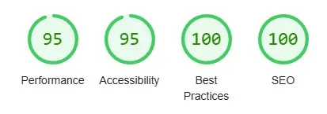
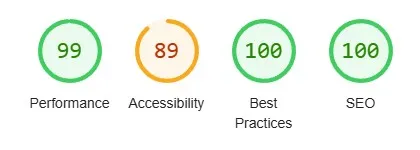

[Return to the Hi-Lo card game README.md](https://github.com/dvfrancis/hi-lo-card-game/blob/main/README.md)

# Testing

## Index

1. [Code Validation](#code-validation)
    1. [HTML](#html)
        1. [index.html](#indexhtml)
        2. [game.html](#gamehtml)
        3. [faq.html](#faqhtml)
        4. [404.html](#404html)
    2. [CSS](#css)
        1. [index.html](#indexhtml-1)
        2. [game.html](#gamehtml-1)
        3. [faq.html](#faqhtml-1)
        4. [404.html](#404html-1)
    3. [JavaScript](#javascript)
        1. [general.js](#generaljs)
        2. [index.js](#indexjs)
        3. [game.js](#gamejs)
2. [Manual Validation](#manual-validation)
    1. [index.html](#indexhtml-2)
    2. [game.html](#gamehtml-2)
    3. [faq.html](#faqhtml-2)
    4. [404.html](#404html-2)
    5. [general.js](#generaljs-1)
    6. [index.js](#indexjs-1)
    7. [game.js](#gamejs-1)
3. [Automated Validation](#automated-validation)
    1. [general.js](#generaljs-2)
    2. [index.js](#indexjs-2)
    3. [game.js](#gamejs-2)
4. [User Story Validation](#user-story-validation)
    1. [First Time Visitor Goals](#first-time-visitor-goals)
    2. [Returning Visitor Goals](#returning-visitor-goals)
    3. [Frequent Visitor Goals](#frequent-visitor-goals)
5. [User Personas](#user-personas)
    1. [User 1](#user-1)
    2. [User 2](#user-2)
    3. [User 3](#user-3)
    4. [User 4](#user-4)
6. [Browser Compatibility](#browser-compatibility)
    1. [Google Chrome](#google-chrome)
    2. [Microsoft Edge](#microsoft-edge)
    3. [Firefox](#firefox)
    4. [Opera](#opera)
    5. [Safari (on an iPhone)](#safari-on-an-iphone)
    6. [Safari (on an iPad)](#safari-on-an-ipad)
7. [Accessibility](#accessibility)
    1. [index.html](#indexhtml-3)
    2. [game.html](#gamehtml-3)
    3. [faq.html](#faqhtml-3)
    4. [404.html](#404html-3)
8. [Responsiveness](#responsiveness)
    1. [index.html](#indexhtml-4)
    2. [game.html](#gamehtml-4)
    3. [faq.html](#faqhtml-4)
    4. [404.html](#404html-4)
9. [Performance](#performance)
    1. [index.html](#indexhtml-5)
    2. [game.html](#gamehtml-5)
    3. [faq.html](#faqhtml-5)
    4. [404.html](#404html-5)
10. [Fixed Bugs](#fixed-bugs)
11. [Unfixed Bugs](#unfixed-bugs)

## Code Validation

### HTML

Below are the results of HTML validation for each page, using the [W3C Markup Validation Service](https://validator.w3.org):

#### index.html

<details>
<summary>Click here to see the HTML validation report for index.html</summary>


</details>

#### game.html

<details>
<summary>Click here to see the HTML validation report for game.html</summary>


</details>

#### faq.html

<details>
<summary>Click here to see the HTML validation report for faq.html</summary>


</details>

#### 404.html

<details>
<summary>Click here to see the HTML validation report for 404.html</summary>


</details>

### CSS

Below are the results of CSS validation for each page, using the [W3C CSS Validation Service](https://jigsaw.w3.org/css-validator).

#### index.html

<details>
<summary>Click here to see the CSS validation report for index.html</summary>


</details>

#### game.html

<details>
<summary>Click here to see the CSS validation report for game.html</summary>


</details>

#### faq.html

<details>
<summary>Click here to see the CSS validation report for faq.html</summary>


</details>

#### 404.html

<details>
<summary>Click here to see the CSS validation report for 404.html</summary>


</details>

### JavaScript

Below are the results of JavaScript validation for each script file, using [JSHint](https://jshint.com/).

#### general.js

<details>
<summary>Click here to see the JavaScript validation report for general.js</summary>


</details>

#### index.js

<details>
<summary>Click here to see the JavaScript validation report for index.js</summary>


</details>

#### game.js

<details>
<summary>Click here to see the JavaScript validation report for game.js</summary>


</details>

## Manual Validation

Here are the results of a manual test of all links, and any form fields, for each page:

### index.html

| ITEM | PROCESS | EXPECTED RESULT | ACTUAL RESULT | STATUS |
| --- | --- | --- | --- | --- |
| Navigation bar link - "Home" | Click to open index.html | The user is directed to index.html | The user is directed to index.html | WORKS AS EXPECTED |
| Navigation bar link - "Game" | Click to open game.html | The user is directed to game.html | The user is directed to game.html | WORKS AS EXPECTED |
| Navigation bar link - "FAQ" | Click to open faq.html | The user is directed to faq.html | The user is directed to faq.html | WORKS AS EXPECTED |
| Button link - "Play"" | Click to open game.html | The user is directed to game.html | The user is directed to game.html | WORKS AS EXPECTED |
| Social media icon - Threads | Click to open Threads in a new tab  | The link opens in a new tab  | The link opens in a new tab | WORKS AS EXPECTED |
| Social media icon - Instagram | Click to open Instagram in a new tab  | The link opens in a new tab  | The link opens in a new tab | WORKS AS EXPECTED |
| Social media icon - Facebook | Click to open Facebook in a new tab  | The link opens in a new tab  | The link opens in a new tab | WORKS AS EXPECTED |
| Footer link - "Dominic Francis" | Click to open dominicfrancis.co.uk in a new tab | The link opens in a new tab  | The link opens in a new tab | WORKS AS EXPECTED |

### game.html

| ITEM | PROCESS | EXPECTED RESULT | ACTUAL RESULT | STATUS |
| --- | --- | --- | --- | --- |
| Navigation bar link - "Home" | Click to open index.html | The user is asked if they want to leave the game. If they click 'Yes', they are directed to index.html, following a five second delay. If they click 'No' the modal dialog disappears, and they remain on game.html  | The user is asked if they want to leave the game. If they click 'Yes', they are directed to index.html, following a five second delay. If they click 'No' the modal dialog disappears, and they remain on game.html | WORKS AS EXPECTED |
| Navigation bar link - "Game" | Click to open game.html | The user is asked if they want to leave the game. If they click 'Yes', game.html is reloaded in the same window (and a new game begins), following a five second delay. If they click 'No' the modal dialog disappears, and they continue their current game on game.html |  The user is asked if they want to leave the game. If they click 'Yes', game.html is reloaded in the same window (and a new game begins), following a five second delay. If they click 'No' the modal dialog disappears, and they continue their current game on game.html | WORKS AS EXPECTED |
| Navigation bar link - "FAQ" | Click to open faq.html | The user is asked if they want to leave the game. If they click 'Yes', they are directed to faq.html, following a five second delay. If they click 'No' the modal dialog disappears, and they remain on game.html | The user is asked if they want to leave the game. If they click 'Yes', they are directed to faq.html, following a five second delay. If they click 'No' the modal dialog disappears, and they remain on game.html | WORKS AS EXPECTED |
| Game - wager entry field (with a valid entry - more than zero and less than total player points) | Enter a valid wager amount, and click 'OK' to submit | The player's wager is accepted, and they are prompted to guess if the next card is higher or lower | The player's wager is accepted, and they are prompted to guess if the next card is higher or lower | WORKS AS EXPECTED |
| Game - wager entry field (with an invalid entry - more than total player points / a zero amount / a blank entry / a text entry) | Enter an invalid wager amount, and click 'OK' to submit | The player's wager is rejected, the field is cleared, a message is displayed "Your wager must be a number between 1 and `playerPoints`. Please try again.", and they are able to re-enter a new amount | The player's wager is rejected, the field is cleared, a message is displayed "Your wager must be a number between 1 and `playerPoints`. Please try again.", and they are able to re-enter a new amount | WORKS AS EXPECTED |
| Game - "Is the next card HIGHER or LOWER than your card?" (with a valid guess) | Player guesses "HIGH" or "LOW" correctly | The next card is displayed, and the game continues | The next card is displayed, and the game continues | WORKS AS EXPECTED |
| Game - "Is the next card HIGHER or LOWER than your card?" (with an invalid guess) | Player guesses "HIGH" or "LOW" incorrectly | The next card is displayed but a modal dialog appears to inform the player that they have lost the round and asks if they want to continue. If they click "YES" a new deck of cards is dealt, and they make their next guess (The ROUND number increases / the CARD number increases / their POINTS are decreased by the wager amount / the WAGER is reset to zero); if they click "NO", the CARD number increases, their POINTS are decreased by the wager amount, their final score is displayed, and they are directed to index.html after five seconds | The next card is displayed but a modal dialog appears to inform the player that they have lost the round and asks if they want to continue. If they click "YES" a new deck of cards is dealt, and they make their next guess (The ROUND number increases / the CARD number increases / their POINTS are decreased by the wager amount / the WAGER is reset to zero); if they click "NO", the CARD number increases, their POINTS are decreased by the wager amount, their final score is displayed, and they are directed to index.html after five seconds | WORKS AS EXPECTED |
| Game - "Is the next card HIGHER or LOWER than your card?" (when it's a draw) | Player guesses "HIGH" or "LOW" correctly | The next card is displayed, but it's a draw. A modal dialog appears to inform the player that it was a draw. The player does not lose their wager, and their points are not reduced | The next card is displayed, but it's a drawer. A modal dialog appears to inform the player that it was a draw. The player does not lose their wager, and their points are not reduced | WORKS AS EXPECTED |
| Game - "Is the next card HIGHER or LOWER than your card?" (when a round is completed successfully) | Player guesses "HIGH" or "LOW" correctly on the final card of a round | A modal dialog appears to inform the player that they won the round and asks if they want to continue. If they click "YES" a new deck of cards is dealt, and they make their next guess (The ROUND number increases / the CARD number increases / their POINTS are increased by the wager amount / the WAGER is reset to zero); if they click "NO", the CARD number increases, their POINTS are increased by the wager amount, their final score is displayed, and they are directed to index.html after five seconds | A modal dialog appears to inform the player that they won the round and asks if they want to continue. If they click "YES" a new deck of cards is dealt, and they make their next guess (The ROUND number increases / the CARD number increases / their POINTS are increased by the wager amount / the WAGER is reset to zero); if they click "NO", the CARD number increases, their POINTS are increased by the wager amount, their final score is displayed, and they are directed to index.html after five seconds.  | WORKS AS EXPECTED |
| Game - "Is the next card HIGHER or LOWER than your card?" (on the penultimate round of a game) | Player guesses "HIGH" or "LOW" correctly on round nine of ten | A modal dialog appears to inform the player that the next round of cards is the final round and asks if they want to continue. If they click "YES" the final deck of cards is dealt, and they make their next guess (The ROUND number increases / the CARD number increases / their POINTS are increased by the wager amount / the WAGER is reset to zero); if they click "NO", the CARD number increases, their POINTS are increased by the wager amount, their final score is displayed, and they are directed to index.html after five seconds | A modal dialog appears to inform the player that the next round of cards is the final round and asks if they want to continue. If they click "YES" the final deck of cards is dealt, and they make their next guess (The ROUND number increases / the CARD number increases / their POINTS are increased by the wager amount / the WAGER is reset to zero); if they click "NO", the CARD number increases, their POINTS are increased by the wager amount, their final score is displayed, and they are directed to index.html after five seconds | WORKS AS EXPECTED |
| Game - "Is the next card HIGHER or LOWER than your card?" (on the final round of a game) | Player guesses "HIGH" or "LOW" correctly or incorrectly on round ten | A modal dialog appears to inform the player that the game has finished, and displays their score for that game as well as their highest score of all the games they have played. The player is also asked if they want to continue; if they click "YES" a new game begins, and they make their next guess (The ROUND number resets to one / the CARD number resets to one / their POINTS are reset to 100 / the WAGER is reset to zero); if they click "NO", they are directed to index.html immediately | A modal dialog appears to inform the player that the game has finished, and displays their score for that game as well as their highest score of all the games they have played. The player is also asked if they want to continue; if they click "YES" a new game begins, and they make their next guess (The ROUND number resets to one / the CARD number resets to one / their POINTS are reset to 100 / the WAGER is reset to zero); if they click "NO", they are directed to index.html immediately | WORKS AS EXPECTED |
| Social media icon - Threads | Click to open Threads in a new tab  | The link opens in a new tab  | The link opens in a new tab | WORKS AS EXPECTED |
| Social media icon - Instagram | Click to open Instagram in a new tab  | The link opens in a new tab  | The link opens in a new tab | WORKS AS EXPECTED |
| Social media icon - Facebook | Click to open Facebook in a new tab  | The link opens in a new tab  | The link opens in a new tab | WORKS AS EXPECTED |
| Footer link - "Dominic Francis" | Click to open dominicfrancis.co.uk in a new tab | The link opens in a new tab  | The link opens in a new tab | WORKS AS EXPECTED |

### faq.html

| ITEM | PROCESS | EXPECTED RESULT | ACTUAL RESULT | STATUS |
| --- | --- | --- | --- | --- |
| Navigation bar link - "Home" | Click to open index.html | The user is directed to index.html | The user is directed to index.html | WORKS AS EXPECTED |
| Navigation bar link - "Game" | Click to open game.html | The user is directed to game.html | The user is directed to game.html | WORKS AS EXPECTED |
| Navigation bar link - "FAQ" | Click to open faq.html | The user is directed to faq.html | The user is directed to faq.html | WORKS AS EXPECTED |
| Accordion header - "What is HI LO?" | Click to expand / collapse the section | The section expands / collapses  | The section expands / collapses | WORKS AS EXPECTED |
| Accordion header - "How do I play?" | Click to expand / collapse the section | The section expands / collapses  | The section expands / collapses | WORKS AS EXPECTED |
| Accordion header - "Is there a minimum or maximum wager for each round?" | Click to expand / collapse the section | The section expands / collapses  | The section expands / collapses | WORKS AS EXPECTED |
| Accordion header - "Are Aces considered high or low?" | Click to expand / collapse the section | The section expands / collapses  | The section expands / collapses | WORKS AS EXPECTED |
| Social media icon - Threads | Click to open Threads in a new tab  | The link opens in a new tab  | The link opens in a new tab | WORKS AS EXPECTED |
| Social media icon - Instagram | Click to open Instagram in a new tab  | The link opens in a new tab  | The link opens in a new tab | WORKS AS EXPECTED |
| Social media icon - Facebook | Click to open Facebook in a new tab  | The link opens in a new tab  | The link opens in a new tab | WORKS AS EXPECTED |
| Footer link - "Dominic Francis" | Click to open dominicfrancis.co.uk in a new tab | The link opens in a new tab  | The link opens in a new tab | WORKS AS EXPECTED |

### 404.html

| ITEM | PROCESS | EXPECTED RESULT | ACTUAL RESULT | STATUS |
| --- | --- | --- | --- | --- |
| Navigation bar link - "Home" | Click to open index.html | The user is directed to index.html | The user is directed to index.html | WORKS AS EXPECTED |
| Navigation bar link - "Game" | Click to open game.html | The user is directed to game.html | The user is directed to game.html | WORKS AS EXPECTED |
| Navigation bar link - "FAQ" | Click to open faq.html | The user is directed to faq.html | The user is directed to faq.html | WORKS AS EXPECTED |
| Navigation link in text - "Alternatively, you might want to play your cards right by visiting the FAQ" | Click to open faq.html | The user is directed to faq.html | The user is directed to faq.html | WORKS AS EXPECTED |
| Auto redirect (after 15 seconds) | The page is automatically redirected to index.html after 15 seconds have elapsed | The index.html page loads after 15 seconds | The index.html page loads after 15 seconds | WORKS AS EXPECTED |
| Social media icon - Threads | Click to open Threads in a new tab  | The link opens in a new tab  | The link opens in a new tab | WORKS AS EXPECTED |
| Social media icon - Instagram | Click to open Instagram in a new tab  | The link opens in a new tab  | The link opens in a new tab | WORKS AS EXPECTED |
| Social media icon - Facebook | Click to open Facebook in a new tab  | The link opens in a new tab  | The link opens in a new tab | WORKS AS EXPECTED |
| Footer link - "Dominic Francis" | Click to open dominicfrancis.co.uk in a new tab | The link opens in a new tab  | The link opens in a new tab | WORKS AS EXPECTED |

### general.js

| ITEM | PROCESS | EXPECTED RESULT | ACTUAL RESULT | STATUS |
| --- | --- | --- | --- | --- |
| Function - updateCopyrightYear | Keep copyright year current, in each page footer | The copyright year, of all footers, is the current year | The copyright year, of all footers, is the current year | WORKS AS EXPECTED |

### index.js

| ITEM | PROCESS | EXPECTED RESULT | ACTUAL RESULT | STATUS |
| --- | --- | --- | --- | --- |
| Function - startGame | Start the game when 'PLAY' is clicked | User is taken to game.html and a new game begins | User is taken to game.html and a new game begins | WORKS AS EXPECTED |

### game.js

| ITEM | PROCESS | EXPECTED RESULT | ACTUAL RESULT | STATUS |
| --- | --- | --- | --- | --- |
| Function - displayPoints | Read playerPoints and display on game.html | The player's points are shown on game.html | The player's points are shown on game.html | WORKS AS EXPECTED |
| Function - decideAces | Generate a True or False value, store as "HIGH" or "LOW", and pass value when calling amendCardsObject  | acesValue stores "HIGH" or "LOW" and this is passed to amendCardsObject | acesValue stores "HIGH" or "LOW" and this is passed to amendCardsObject | WORKS AS EXPECTED |
| Function - amendCardsObject | Update cardsObject so the value of any Aces are either 1 or 14 | cardsObject contains Aces that have a value of either 1 or 14 | cardsObject contains Aces that have a value of either 1 or 14 | WORKS AS EXPECTED |
| Function - displayAces | Read acesValue and display on game.html | "ACES ARE LOW" or "ACES ARE HIGH" is displayed on game.html  | "ACES ARE LOW" or "ACES ARE HIGH" is displayed on game.html | WORKS AS EXPECTED |
| Function - createModal | Create and store a Bootstrap modal dialog, insert at the end of the HTML file | The modal is inserted into the HTML, and messageModal contains a DOM reference to the newly created modal | The modal is inserted into the HTML, and messageModal contains a DOM reference to the newly created modal | WORKS AS EXPECTED |
| Function - displayModal | If messageModal exists then make it visible, or log an error message | The modal is displayed on the page, or an error is logged | The modal is displayed on the page, or an error is logged | WORKS AS EXPECTED |
| Function - deleteModal | If messageModal exists then delete it, or log an error message | The modal is deleted from the HTML file, or an error is logged | The modal is deleted from the HTML file, or an error is logged | WORKS AS EXPECTED |
| Function - shuffleCards | Make an API call to shuffle a new pack of cards, set initial variables for the game, and call drawCards | A new deck of cards is generated, variables initialised, and drawCards called | A new deck of cards is generated, variables initialised, and drawCards called | WORKS AS EXPECTED |
| Function - drawCards | Draw five cards, create the initial card view and display the first card, display the wager, reset al initial variables before the round starts, decide and display value of Aces for the round, display round and card number, and call getWager | Five cards are displayed, along with all other relevant information, and getWager is called | Five cards are displayed, along with all other relevant information, and getWager is called | WORKS AS EXPECTED |
| Function - displayRound | Read roundCount and display on game.html | The current round number is displayed | The current round number is displayed | WORKS AS EXPECTED |
| Function - initialView | Create and display the initial card view | The initial card view is displayed | The initial card view is displayed | WORKS AS EXPECTED |
| Function - getWager | Get the player's wager, and pass value when calling handleWagerSubmit | Get a wager amount from the player, and pass value when calling handleWagerSubmit | Get a wager amount from the player, and pass value when calling handleWagerSubmit | WORKS AS EXPECTED |
| Function - handleWagerSubmit | Check that the player's wager is valid | A valid wager is stored in playerWager, the current card number is displayed on game.html, the current wager is displayed on game.html, and playerChoice is called | A valid wager is stored in playerWager, the current card number is displayed on game.html, the current wager is displayed on game.html, and playerChoice is called | WORKS AS EXPECTED |
| Function - displayWager | Read playerWager and display on game.html | The current wager is displayed | The current wager is displayed | WORKS AS EXPECTED |
| Function - playerChoice | Get the player's higher or lower choice, and pass the value when calling flipCard  | The player's choice is passed to flipCard | The player's choice is passed to flipCard | WORKS AS EXPECTED |
| Function - flipCard | Use playerChoice to reveal each card, based on whether the choice was valid or not. Display the card and call playerChoice | The card is revealed | The card is revealed | WORKS AS EXPECTED |
| Function - displayCard | Read totalCards and display on game.html | The current card number is displayed | The current card number is displayed | WORKS AS EXPECTED |
| Function - calculateOutcome | Calculate if the player's choice was correct and what the next step should be | The player's choice is evaluated and they are then directed to the next step (based on that calculation) | The player's choice is evaluated and they are then directed to the next step (based on that calculation) | WORKS AS EXPECTED |
| Function - continueGame | Display the appropriate modal dialog asking if the player wishes to continue, based on the result of their last guess | The correct modal dialog is displayed | The correct modal dialog is displayed | WORKS AS EXPECTED |
| Function - decideGameState | Determine where the player is in the game | Player is guided along the correct decision path based on their position in the game | Player is guided along the correct decision path based on their position in the game | WORKS AS EXPECTED |
| Function - gameOver | Display modal dialog at the end of a game, asking what the player wants to do next | Modal dialog is displayed, and player decides whether to play again or exit the game | Modal dialog is displayed, and player decides whether to play again or exit the game | WORKS AS EXPECTED |
| Function - displayScore | If player exits a game early, display their final score and redirect to index.html | Final score is displayed, and player is directed to the correct page according to their choice | Final score is displayed, and player is directed to the correct page according to their choice | WORKS AS EXPECTED |
| Function - finalRound | Display a modal dialog informing the player they have reached the final round, and ask if they want to continue | A modal dialog is displayed and player chooses next step | A modal dialog is displayed and player chooses next step | WORKS AS EXPECTED |
| Function - noPoints | End the game if the player has exhausted their points | A modal dialog is displayed informing the player they have no points remaining, and asking what they wish to do next | A modal dialog is displayed informing the player they have no points remaining, and asking what they wish to do next | WORKS AS EXPECTED |
| Function - leaveGame | Display a modal dialog asking the player if they want to abandon the game | A modal dialog is displayed and player chooses next step; if they want to leave, their final score is displayed and they are redirected to index.html after five seconds; if not, they remain on the same page | A modal dialog is displayed and player chooses next step; if they want to leave, their final score is displayed and they are redirected to index.html after five seconds; if not, they remain on the same page | WORKS AS EXPECTED |

## Automated Validation

I've done one test for each of the three JavaScript files (general.js, index.js, and game,js) as, unfortunately, I ran out of time to do any more.

The `module.exports` commmand, required by Jest at the end of each JavaScript file, causes an `Uncaught ReferenceError: module is not defined` in the browser. This is because it is Node.js-specific and part of the CommonJS module system, whereas the browser uses the ES6 module system. I have therefore run the tests with this code and then deleted it from each file - this doesn't affect the functioning of the website in any way.

Shown below are the exact commands used in each file, alongside the tests used by the test files.

### general.js

Export command for Jest testing (removed after testing)

```
module.exports = {
    updateCopyrightYear
};
```

Jest tests from general.test.js:

```
describe('updating the copyright year', () => {
    beforeEach(() => {
        document.body.innerHTML = '<div id="copyright"></div>'; // Create mock DOM element for testing
    });

    test('should update copyright year', () => {
        const {
            updateCopyrightYear
        } = require('../general'); // Import JavaScript file
        updateCopyrightYear(); // Run function to be tested
        const yearNow = new Date().getFullYear(); // Create yearNow variable for testing below
        expect(document.getElementById('copyright').innerHTML).toBe(` ${yearNow} `); // Assert the result
    });
});
```

### index.js

Export command for Jest testing (removed after testing)

```
module.exports = {
  startGame
};
```

Jest tests from index.test.js:

```
describe('starting the game', () => {
    beforeEach(() => {
        document.body.innerHTML = '<input type="submit" id="play-game" value="PLAY">'; // Create mock DOM element for testing
        delete window.location; // Remove current window object
        window.location = {
            href: ''
        }; // Create mock window object
    });

    test('should navigate to game.html when play-game button clicked', () => {
        const {
            startGame
        } = require('../index'); // Import JavaScript file
        startGame(); // Run function to be tested
        const playGame = document.getElementById("play-game");
        playGame.click(); // Simulate play-game button click
        expect(window.location.href).toBe("game.html"); // Assert the result
    });
});
```

### game.js

Export command for Jest testing (removed after testing)

```
module.exports = {
  leaveGame
};
```

Jest tests from game.test.js:

```
describe('gameplay', () => {
    beforeEach(() => {
        document.body.innerHTML = '<input type="submit" id="play-game" value="PLAY">';
        delete window.location;
        window.location = {
            href: ''
        };
    });

    test("leaveGame function should navigate to specified URL", () => {
        const {
            leaveGame
        } = require('../game');
        const testUrl = "index.html";
        leaveGame(testUrl);
        expect(window.location.href).toBe(testUrl);
    });
});
```

All three tests passed successfully.


## User Story Validation

### First Time Visitor Goals

“What is this website about?”

<details>
<summary>Click here to see proof of first time visitor goal number 1</summary>


</details>

| ITEM | PROCESS | EXPECTED RESULT | ACTUAL RESULT | STATUS |
| --- | --- | --- | --- | --- |
| Home page | Scroll down to the text box | View information about the website | View information about the website | WORKS AS EXPECTED |

“How do you play the game?”, “What are the rules of the game?”, and "What can I win?"

<details>
<summary>Click here to see proof of first time visitor goals 2 to 4</summary>


</details>

| ITEM | PROCESS | EXPECTED RESULT | ACTUAL RESULT | STATUS |
| --- | --- | --- | --- | --- |
| FAQ page | Navigate to the FAQ page using the navigation link at the top of each page, and scroll down to the FAQ accordion | View information about the game and how to play it | View information about the game and how to play it | WORKS AS EXPECTED |

### Returning Visitor Goals

“Will I be able to beat my score from the last time I played?”

<details>
<summary>Click here to see proof of the returning visitor goal</summary>


</details>

| ITEM | PROCESS | EXPECTED RESULT | ACTUAL RESULT | STATUS |
| --- | --- | --- | --- | --- |
| Game page | Complete a game of 10 rounds of five cards | Modal dialog displays current game score, and highest previous score | Modal dialog displays current game score, and highest previous score | WORKS AS EXPECTED |

### Frequent Visitor Goals

“I would like to play the game on my mobile device, while travelling”

<details>
<summary>Click here to see proof of the frequent visitor goal</summary>


</details>

| ITEM | PROCESS | EXPECTED RESULT | ACTUAL RESULT | STATUS |
| --- | --- | --- | --- | --- |
| Game page | Navigate to the game page on a mobile device | The game adapts to the screen size and can still be played | The game adapts to the screen size and can still be played | WORKS AS EXPECTED | 

## User Personas

### User 1

| ACCEPTANCE CRITERIA | TASKS | STATUS |
| --- | --- | --- |
| The website is responsive and displays correctly on a mobile device | Style a responsive website using Bootstrap and / or media queries | COMPLETED SUCCESSFULLY |
| All messages are clearly displayed and easy to read on smaller screens | Display any system messages in a larger format | COMPLETED SUCCESSFULLY |

### User 2

| ACCEPTANCE CRITERIA | TASKS | STATUS |
| --- | --- | --- |
| The website is quick to load | Ensure the website has excellent load performance on Google Lighthouse | COMPLETED SUCCESSFULLY |
| The game can be abandoned, if necessary | Add ability to navigate away from the game at any point | COMPLETED SUCCESSFULLY |

### User 3

| ACCEPTANCE CRITERIA | TASKS | STATUS |
| --- | --- | --- |
| Gameplay is streamlined and easy to understand, offering an easy distraction to daily life | Add an FAQ page that explains the game and its rules, and guide the user through the game via messages on screen | COMPLETED SUCCESSFULLY |

### User 4

| ACCEPTANCE CRITERIA | TASKS | STATUS |
| --- | --- | --- |
| The game has a visually interesting design | Implement a design that is bright and colourful | COMPLETED SUCCESSFULLY |
| Cards and scores are displayed clearly and are easy to understand | Display scores clearly on all screen sizes and ensure cards are easy to see and understand | COMPLETED SUCCESSFULLY |

## Browser Compatibility

The following browsers have been used to test the website (screenshots taken from a Windows desktop setup for a clearer view - there is no Windows version of Safari):

### Google Chrome

<details>
<summary>Click here to view the site in Google Chrome</summary>


</details>

### Microsoft Edge

<details>
<summary>Click here to view the site in Microsoft Edge</summary>


</details>

### Firefox

<details>
<summary>Click here to view the site in Firefox</summary>


</details>

### Opera

<details>
<summary>Click here to view the site in Opera</summary>


</details>

### Safari (on an iPad)

Unfixed bug 76 (below) relates to this screenshot.

<details>
<summary>Click here to view the site in Safari (on an iPad)</summary>


</details>

## Accessibility

Accessibility was tested on all pages with the [Wave Accessibility Evaluation Tool (WAVE)](https://wave.webaim.org):

#### index.html

<details>
<summary>Click here to see the accessibility report for index.html</summary>


</details>

#### game.html

<details>
<summary>Click here to see the accessibility report for game.html</summary>


</details>

#### faq.html

<details>
<summary>Click here to see the accessibility report for faq.html</summary>


</details>

#### 404.html

The error is caused by the auto-redirect on this page, which is a design feature. The alert is for a possible redundant tag, linking to faq.html, which is also part of the intended design:

<details>
<summary>Click here to see the accessibility report for 404.html</summary>


</details>

## Responsiveness

Pages were tested for responsiveness on mobile (Apple iPhone 6s Plus/7 Plus - 414px x 736px), tablet (Amazon Kindle Fire - 768px 1024px), and desktop (24" - 1920px x 1200px), using the [Responsive Web Design Checker](https://responsivedesignchecker.com/). On the game.html page, the playing cards are not appearing as the Responsive Web Design Checker is not pulling them from the API (although they appear as expected in all browsers tested).

### index.html

#### Mobile

<details>
<summary>Click here to see the responsiveness report for index.html, on a mobile device</summary>


</details>

#### Tablet

<details>
<summary>Click here to see the responsiveness report for index.html, on a tablet device</summary>


</details>

#### Desktop

<details>
<summary>Click here to see the responsiveness report for index.html, on a desktop device</summary>


</details>

### game.html

#### Mobile

<details>
<summary>Click here to see the responsiveness report for game.html, on a mobile device</summary>


</details>

#### Tablet

<details>
<summary>Click here to see the responsiveness report for game.html, on a tablet device</summary>


</details>

#### Desktop

<details>
<summary>Click here to see the responsiveness report for game.html, on a desktop device</summary>


</details>

### faq.html

#### Mobile

<details>
<summary>Click here to see the responsiveness report for faq.html, on a mobile device</summary>


</details>

#### Tablet

<details>
<summary>Click here to see the responsiveness report for faq.html, on a tablet device</summary>


</details>

#### Desktop

<details>
<summary>Click here to see the responsiveness report for faq.html, on a desktop device</summary>


</details>

### 404.html

#### Mobile

<details>
<summary>Click here to see the responsiveness report for 404.html, on a mobile device</summary>


</details>

#### Tablet

<details>
<summary>Click here to see the responsiveness report for 404.html, on a tablet device</summary>


</details>

#### Desktop

<details>
<summary>Click here to see the responsiveness report for 404.html, on a desktop device</summary>


</details>

## Performance

Mobile and desktop page performance was assessed using the [Google Lighthouse](https://developer.chrome.com/docs/lighthouse/):

### index.html

#### Mobile

<details>
<summary>Click here to see the mobile performance report for index.html</summary>


</details>

#### Desktop

<details>
<summary>Click here to see the desktop performance report for index.html</summary>


</details>

### game.html

#### Mobile

<details>
<summary>Click here to see the mobile performance report for game.html</summary>


</details>

#### Desktop

<details>
<summary>Click here to see the desktop performance report for game.html</summary>


</details>

### faq.html

#### Mobile

<details>
<summary>Click here to see the mobile performance report for faq.html</summary>


</details>

#### Desktop

<details>
<summary>Click here to see the desktop performance report for faq.html</summary>


</details>

### 404.html

As the site design requires an automatic redirect on this page, it results in a slightly lower accessibility score for both metrics.

#### Mobile

<details>
<summary>Click here to see the mobile performance report for 404.html</summary>


</details>

#### Desktop

<details>
<summary>Click here to see the desktop performance report for 404.html</summary>


</details>

## Fixed Bugs

The fixed bugs listed here are numbered to match the cases logged in the GitGub repository project (they do not follow a set sequential order).

### Bug 47

<details>
<summary>Click here to see a screenshot showing the result of bug 47</summary>


</details>

| Bug | Fix |
| --- | --- |
| Nav link is too close to right-hand side edge of the page | The following code below was added to remove extraneous padding elsewhere but this also affected the padding on the nav link `.row > * { padding-left: 0 !important; padding-right: 0 !important; }`. I added this selector beneath the above to over-ride its effects `#nav { padding-right: 15px !important; }` |

### Bug 52

<details>
<summary>Click here to see a screenshot showing the result of bug 52</summary>


</details>

| Bug | Fix |
| --- | --- |
| The initial card view is not displaying any playing cards | I renamed some classes and IDs in JavaScript and HTML but forgot to use the correct names in my initial JavaScript variable declarations. Once I had updated those the cards were displayed correctly |

### Bug 61

<details>
<summary>Click here to see a screenshot showing the result of bug 61</summary>


</details>

| Bug | Fix |
| --- | --- |
| Renamed some classes and IDs to help in coding but now cards are not resizing correctly when flipped | This is the code I amended to auto-generate the id name based on array position `cards[cardIndex].innerHTML = ;`. However, looking at this in the browser console it appears the name is not generating as I expected - it says `id="card-[object Object]"` when it should be `id="card-1"` or `id=card-2`, etc. What I needed to do was simplify the code to just use the currentCard variable (which stores the index of the currently flipped card) - `cards[cardIndex].innerHTML = ; // Flip the next card`. Now the cards are targeted by the CSS correctly, and display at their correct size |

### Bug 62

<details>
<summary>Click here to see a screenshot showing the result of bug 62</summary>


</details>

<details>
<summary>Click here to see a screenshot showing the result when bug 62 was fixed</summary>


</details>

| Bug | Fix |
| --- | --- |
| When playing the game it should get to the last (known as the fourth) card and then calculate if you have won or lost. At the moment it gets to the third card and then calculates if you have won or lost | The correctGuesses variable needs to be of value 4 before the game calculates if you have won or lost. However, it was only reaching 3 because there was a section of unnecessary code in the flipCard function that was from an earlier version of the code. Once removed, correctGuesses could correctly increment to 4 and the game could complete successfully |

### Bug 63

<details>
<summary>Click here to see a screenshot showing the result of bug 63</summary>


</details>

| Bug | Fix |
| --- | --- |
| When a round is won, instead of drawing a new deck of cards the game appears to be drawing a random number of decks. The console.log output after four winning rounds shows the multiple drawn decks | When a player wins a round they are asked if they wish to continue. My code uses a Bootstrap modal template that is stored in a variable, and an event listener is added to the 'Yes' button of this modal each time the round is completed. I hadn't removed this event listener between rounds and so, as the game progressed, additional event listeners were being added to the button and then all of them were calling the drawCards function when the 'Yes' button was clicked. I added the following into my code to remove any previous event listener `bsBtn1.removeEventListener("click", handleClick);`. I also added this to the drawCards function, using a variable called cardsDrawn to act as a true or false checkpoint. The cardsDrawn variable is set to true when the drawCards function runs (preventing the drawCards function being called multiple times in a short space of time), and to false by the continueGame function (to allow a new deck to be drawn from the current card pile) `if (cardsDrawn) {return;} // Additional check to ensure that the drawCards function is not called multiple times` |

### Bug 66

<details>
<summary>Click here to see a screenshot showing the result of bug 66</summary>


</details>

| Bug | Fix |
| --- | --- |
| Points reset at the start of each round instead of at the start of a new game, and points are not updating correctly at the start of the new round | I was declaring the code shown above with all the variables at the top of the code, and it was picking up the default value for playerPoints from there everytime the HTML was inserted into the game.html page, when I moved it into the getWager function the problem was resolved |

### Bug 67

<details>
<summary>Click here to see a screenshot showing the multiple modal elements in game.html caused by bug 67 (in the lower centre of the image)</summary>


</details>

<details>
<summary>Click here to see a screenshot showing the API error caused by bug 67 (on the bottom right of the image)</summary>


</details>

<details>
<summary>Click here to see a screenshot showing the newly generated pack of cards when bug 67 was fixed (on the bottom right of the image)</summary>


</details>

| Bug | Fix |
| --- | --- |
| When you play all ten rounds of the game it should display a modal that asks if you wish to start a new game. What it is actually doing is trying to carry on drawing cards from the exhausted deck, and this prompts the API to return an error | In the hideModal function (later renamed to deleteModal) I was using code to hide all modal windows created during program use. Unfortunately, this was only hiding them and, as more modals were added to the document, it was having a negative effect on the way the game ran - for example, the modal that asks if you wish to start a new game was not being displayed at the end of the game. I altered the code to completely remove the modal using `messageModal.remove()` once it had been displayed, and this fixed the problem. Now when the pack is empty the modal that asks if you wish to start a new game is displayed so that the player can start a new game (and create a new pack of cards in the process) |

### Bug 71

| Bug | Fix |
| --- | --- |
| When noPoints() or finalRound() are invoked they immediately redirect to index.html | In both functions, I was calling the leaveGame() function via an addEventListerner event `bsBtn2.addEventListener("click", leaveGame("index.html"));`. However, this immediately runs the called function, so I had to wrap them in an anonymous function so they were only called when the associated button was clicked, and not when the script file itself was loaded `bsBtn2.addEventListener("click", function () {leaveGame("index.html")});` |

### Bug 72

<details>
<summary>Click here to see a screenshot showing the result of bug 72</summary>


</details>

| Bug | Fix |
| --- | --- |
| Blocked aria-hidden on an element | I removed `aria-hidden="true"` from the code shown above |

### Bug 75

<details>
<summary>Click here to see a screenshot showing the first part of the result of bug 75</summary>


</details>

<details>
<summary>Click here to see a screenshot showing the second part of the result of bug 75</summary>


</details>

| Bug | Fix |
| --- | --- |
| Fetch error in console when using Jest tests | Although the Jest test run as expected, this error was caused by `console.error('Fetch error:', error);`, which is used in a try / catch statement. When the line is commented out, the error disappears (However, I cannot remove the line completely as it is essential to the code) |

## Unfixed Bugs

The unfixed bugs listed here are numbered to match the cases logged in the GitGub repository project (they do not follow a set sequential order). Despite best efforts, I was unable to fix them.

### Bug 74

<details>
<summary>Click here to see a screenshot of the console error produced by bug 74</summary>


</details>

| Bug | Fix |
| --- | --- |
| The background image that is being loaded using `background: #1A4E04 url("assets/images/playing-cards-background.webp") center cover no-repeat;` is not loading, and is instead returnng an error in the console | I tried using the following - a combined background selector command, a separate background selector commands, the full file path, the relative file path, a different image location, recreating the image, compressing the image, checking all spelling, checking all tags were closed. None of these fixed the issue. I also brought it up with my mentor, Julia Konovalova, and she couldn't work out why it wasn't working either. She did suggest it might be something to do with Bootstrap. Ultimately, I decided not to use an image on the page |

### Bug 76

<details>
<summary>Click here to see a screenshot showing the result of bug 76</summary>


</details>

| Bug | Fix |
| --- | --- |
| The button text on the 'PLAY' button on index.html is misaligned only when using the Safari browser | I ran out of time to fix this issue |